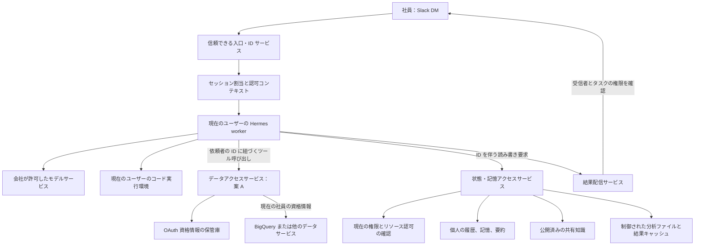
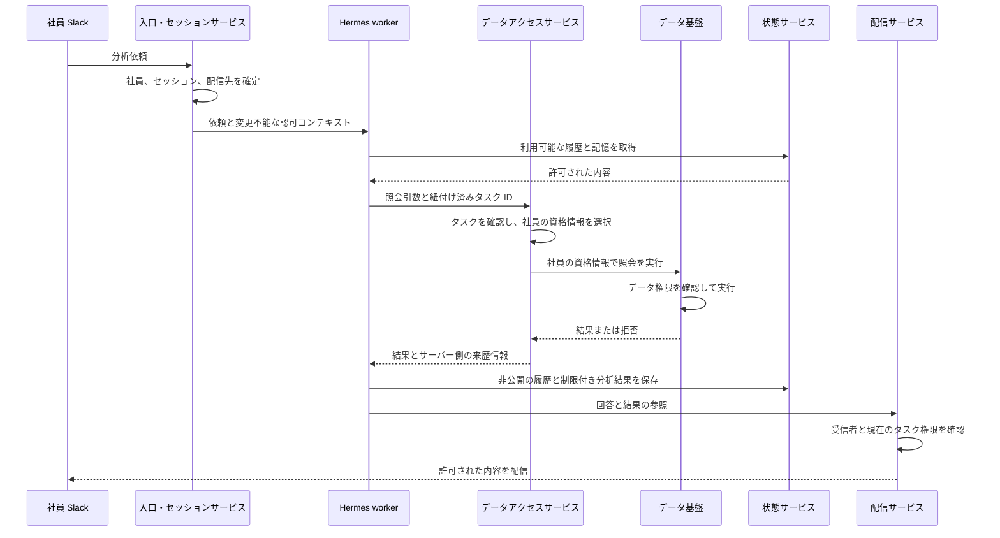
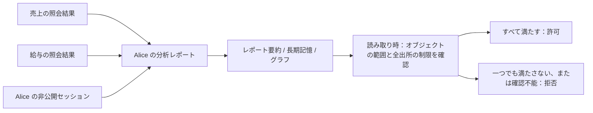
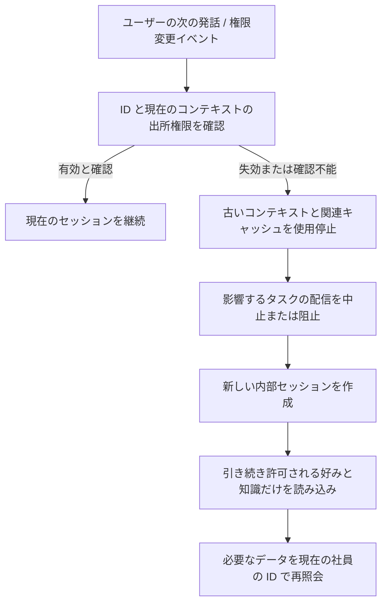

# 企業向け Slack データ分析エージェント：ユーザー権限、記憶の分離、デプロイ構成

> 文書の状態：技術レビューと実装計画のためのアーキテクチャ設計案です。記載したサービス、インターフェース、データ構造はまだ実装されていません。
>
> 作成日：2026-09-25。Hermes のコードを確認したコミット：`19201c61c0`。
>
> 現時点の方針：案 A を暫定採用し、社員本人のデータアクセス資格情報で元データを照会します。履歴、記憶、分析ファイルへのアクセス制御は別途整備します。

目次：

- [目的と既知の条件](#1-目的と設計方針)：第 1～3 節。
- [案の比較と全体構成](#4-案-a-と案-b-の比較と選択)：第 4～6 節。
- [案 A の照会フロー](#7-案-a-の照会フロー)：第 7 節。
- [記憶、派生コンテンツ、権限剥奪](#8-セッション長期記憶共有知識)：第 8～11 節。
- [Slack とデプロイ構成](#12-slack-への出力と共有チャンネル)：第 12～13 節。
- [部品の選定と Hermes の改修](#14-利用できる部品と選定上の注意)：第 14～15 節。
- [実装、受け入れ、運用](#16-段階的な実装と移行)：第 16～19 節。

図は 4 点とも Mermaid で記述しています。Mermaid 対応の Markdown ビューアーで表示できます。

## 1. 目的と設計方針

社員は Slack から Hermes と対話します。システムは実際の依頼者の権限に従ってデータ分析を提供し、各社員が許可されたデータセットを利用できるようにします。同時に、照会、履歴の想起、長期記憶、結果キャッシュ、ファイル読み取りを通じて権限外のデータを取得できないようにします。

推奨する構成は次のとおりです。

1. Slack bot と入口サービスは共通にし、信頼できるコードで社員を識別します。
2. 案 A を採用します。データアクセスサービスが社員に紐づく Google の資格情報で照会を実行し、元データのアクセス可否はデータ基盤が判定します。
3. 各社員のセッション、個人の長期記憶、作業ファイルを標準で分離します。同じ社員はセッションをまたいで自分の記憶を利用できます。
4. 共有知識は独立した公開・読み取りの仕組みで管理します。チームの一員であることだけでは、元データ由来の制限を解除できません。
5. 照会結果、要約、グラフ、キャッシュ、スキルファイルには、関連する元データのアクセス制限を引き継がせます。権限変更後は再確認します。
6. モデルが生成したコードを実行する環境を、資格情報、ユーザーをまたぐ状態ストア、管理用インターフェースから隔離します。
7. 初期段階で bronze / silver / gold ごとに完全なエージェントを固定配置しません。実行環境の隔離や機密性の高い業務領域の要件に応じて、worker や独立デプロイを使い分けます。

案 A が扱うのは元データへのアクセスです。すでにエージェント側へ複製されたデータは自動的には保護されません。全体の設計には、両方のアクセス経路を含める必要があります。

## 2. 既知の条件、仮定、要確認事項

### 2.1 既知の条件

| 条件 | 現在の理解 |
|---|---|
| データの所在 | 会社のデータは GCP 上にある |
| データの構成 | 基盤には bronze、silver、gold などの加工レイヤーがある |
| 利用経路 | 社員は Slack からエージェントと対話する |
| ユーザー ID | 各 Slack ユーザーには一意に対応する Google アカウントがあり、社員は適切なグループに所属している |
| 権限の違い | 社員ごとにアクセスを許可されたデータセットが異なる |
| 現在の実行方式 | Hermes は GCP VM 上で動作し、現在のサービスアカウント（SA）は全業務データにアクセスできる |
| 現在の判断 | 元データへのアクセス方法として、ひとまず案 A を検討する |

### 2.2 設計上の仮定

本書では BigQuery を例に照会フローを説明しますが、すべてのデータが BigQuery にあるとは確認できていません。実際には GCS、別のデータベース、独自のデータ基盤を使用する場合、データソースごとに社員本人としてアクセスする方法と、その権限の意味を確認する必要があります。

案 A の前提は、データ基盤における社員の実際の権限で、会社が求めるアクセス範囲を表現できることです。Google グループへの所属だけで、そのグループに対象データセットの IAM 権限が付与されているとは限りません。この対応関係は稼働前に検証します。

bronze / silver / gold はデータの加工段階を表します。機密レベルとの対応や各レイヤーの閲覧者は、会社の権限ルール次第です。レイヤーの順序と閲覧権限の包含関係を同一視しません。

### 2.3 稼働前の確認事項

| 確認事項 | 設計への影響 |
|---|---|
| 実際のデータサービスとアクセス方法 | 各コネクターが社員の資格情報をどう利用するかを決める |
| Google グループがデータ権限を直接制御しているか | 案 A で既存の権限をどこまで再利用できるかを決める |
| 行単位・列単位の制限や承認済みビューがあるか | 派生した結果をユーザー間で再利用できるかを左右する |
| 社員の既存権限に書き込み・管理権限が含まれるか | エージェント側で追加制限する操作を決める |
| 初版は DM のみ許可するか | 共有チャンネルへの出力と履歴取り込みの複雑さを左右する |
| Python、terminal、ブラウザーが必要か | 実行環境とネットワーク分離の要件を決める |
| チーム知識を自動蓄積する必要があるか | 共有記憶と来歴追跡の実装優先度を決める |
| 権限剥奪を何分・何時間以内に反映すべきか | 変更通知、権限チェック、キャッシュ方針を決める |
| モデル、記憶サービス、ログが扱えるデータの範囲 | 利用可能なサービスと配置場所を決める |

## 3. アクセス制御の対象と基本原則

### 3.1 保護すべき対象

元データのほか、次のものにも業務データが含まれる可能性があります。

- 現在のセッションのメッセージ、ツールの結果、圧縮要約。
- 個人の長期記憶、チームの記憶、組織の知識。
- セッション名、検索結果の要約、プレビュー、履歴のエクスポート。
- CSV、グラフ、Notebook、一時ファイル、ファイルに保存されたツール出力。
- 検索インデックス、ベクトルレコード、結果キャッシュ、バックグラウンドの抽出処理。
- 自動生成されたスキル、分析スクリプト、サンプルデータ、再利用テンプレート。
- Slack の返信、ストリーミング出力、添付ファイル、バックグラウンド通知、定期レポート。

アクセス制御の要否はコンテンツとその出所で決まります。ファイル名や保存形式では決まりません。数値を自然言語に要約しても、制限対象のデータである可能性は残ります。

### 3.2 維持すべき原則

| 原則 | 意味 |
|---|---|
| 信頼できる ID | ユーザー ID は検証済みの入口リクエストから得る。モデルが指定したユーザー ID、メールアドレス、profile 名で権限を決めない |
| 読み取り前に判定 | 許可されていない内容をそのユーザーのモデルコンテキストに入れない |
| 標準は非公開 | 新しいセッション、個人の記憶、分析結果は現在の社員に属する |
| 出所の制限を保持 | 要約、埋め込み、チーム記憶への保存だけで派生コンテンツの公開範囲を広げない |
| 入口を漏れなく保護 | 検索、ID 指定の読み取り、一覧、復元、ページ送り、ダウンロード、バックグラウンド処理をすべて認可する |
| 現在の権限を適用 | 過去の権限を根拠に、現在のエージェントから古い結果を読ませない |
| 迂回経路をなくす | terminal、ファイルツール、別のコネクター、管理コマンドから制御を迂回できないようにする |
| 正当な利用を保つ | 越権を拒否することと、許可されたデータ分析が成功することの両方をテストする |

この設計が制御するのは、システムがこれから提供するデータアクセスです。Slack にすでに正当に配信された内容や社員がダウンロード済みの内容は、後日の権限剥奪だけでは回収できません。インフラ管理者のアクセスは、別途インフラの権限で管理します。

## 4. 案 A と案 B の比較と選択

### 4.1 二つの案の違い

| 比較項目 | A：社員本人の資格情報で照会 | B：認可代理が SA で照会 |
|---|---|---|
| Slack からの利用 | 継続 | 継続 |
| データサービスから見える ID | 社員本人 | 代理が使用する SA |
| 元データの権限判定 | データ基盤が社員の権限に基づき実施 | 代理が社員の認可ルールを適用し、データ基盤は SA の権限も確認 |
| 主な構築作業 | ユーザーの紐付け、資格情報の保管、リクエストごとの資格情報選択 | 権限ルール、照会制約、制御された実行、ルールの同期 |
| 任意の SQL | データ基盤による参照先の権限チェックを再利用できる | すべてのデータアクセス経路を確実に制限する必要があり、複雑になりやすい |
| ユーザー体験 | 初回 OAuth 連携や後日の再認証が必要になることがある | 通常は社員ごとの Google OAuth 連携が不要 |
| 監査 | データ基盤が社員本人として操作を処理し、アプリ側でも Slack の依頼と結び付ける | SA の操作を実際の社員と信頼できる方法で結び付ける必要がある |
| 履歴・記憶の権限 | 別途実装が必要 | 別途実装が必要 |

現時点では A を優先します。社員の Google アカウントとグループがすでに存在し、既存のデータ権限を再利用できる可能性があるためです。ただし、最終的な判断は実際の IAM 権限を検証してから行います。

適切な社員本人のアクセス方法を持たないデータソースや、エージェント独自のデータアクセスルールを設けたいデータソースには、B を適用できます。方式を混在させる場合も、A の照会失敗時に高権限 SA で自動再試行してはいけません。

### 4.2 SA と社員本人の ID

VM に付与された SA は実行環境から取得できる ID の一つであり、すべての API 呼び出しに強制されるわけではありません。BigQuery クライアントには社員の資格情報を明示的に渡せます。明示しなければ、デフォルト資格情報の仕組みに従って利用可能な ID が選ばれます。[クライアントの引数](https://docs.cloud.google.com/python/docs/reference/bigquery/latest/google.cloud.bigquery.client)、[デフォルト資格情報の探索](https://docs.cloud.google.com/docs/authentication/application-default-credentials)。

したがって案 A では、現在の照会経路を変更し、モデルの実行環境から全データにアクセスできる SA の使用手段を取り除く必要があります。通常の照会ツールに社員の token を追加しても、自由に利用できる全データ SA が残っていればアクセス境界にはなりません。

サービス呼び出しやログ記録に必要な低権限の実行用 SA は残せます。業務データの照会には社員の資格情報を使います。サービスアカウントの偽装で適用されるのは対象 SA の権限であり、社員本人のデータ権限が自動的に引き継がれるわけではありません。[Google の SA 偽装の説明](https://docs.cloud.google.com/iam/docs/service-account-impersonation)。

## 5. 全体構成と信頼境界



図は論理コンポーネントを示しています。すべてを別々のサービスとしてデプロイする必要はありません。モデルが生成したコードの実行部分と、複数ユーザーの資格情報や状態へのアクセス権を持つ部分の間には、実際の権限、ファイルシステム、ネットワークによる境界が必要です。同じ Unix ユーザーで二つのプロセスに分けるだけでは十分に隔離できません。

| コンポーネント | 持てる権限 | 制限すべき行為 |
|---|---|---|
| Slack の入口・ID サービス | Slack 接続情報、社員の対応関係、依頼者 ID の発行 | ユーザー入力を ID として採用しない。管理資格情報を worker に渡さない |
| セッション割当 | ユーザーのセッション作成・関連付け、worker 割当 | Alice の稼働中のコンテキストを Bob に流用しない |
| Hermes worker | 現在のユーザーとタスクに限られたサービス利用権 | 他ユーザーの資格情報、全データ用 DB パスワード、ユーザーをまたぐディレクトリを取得しない |
| データアクセスサービス | 社員別 OAuth 資格情報の取得と照会の実行 | worker が別の社員を任意指定できないようにする。高権限 ID へフォールバックしない |
| 状態・記憶サービス | 履歴、記憶、ファイルのメタデータの制御付き読み書き | 全操作でリソース認可を行う。任意の DB クエリ機能を公開しない |
| コード実行環境 | 現在のユーザーが利用を許可されたデータと作業ファイル | ホストの資格情報、他ユーザーのファイル、制御サービスの管理画面へアクセスしない |
| 結果配信サービス | 紐付け済みの宛先に内容を送信 | モデルが機密結果の受信者やチャンネルを任意変更できないようにする |

信頼されたサービス自体には複数社員の記録へのアクセスが必要な場合があります。その権限はサービス側の実装にだけ与え、モデルやユーザーがツールの引数、スクリプト、ファイル読み取りによって同じ権限を得られないようにします。

## 6. ユーザー ID の紐付けとリクエストコンテキスト

### 6.1 社員の識別子

入口では少なくとも Slack workspace ID と user ID の組を使い、安定した社内の社員 ID に対応付けます。変更可能な表示名を主キーにせず、プロンプト内にユーザー名が書かれていることを認証として扱いません。

HTTP の入口では Slack のリクエストを検証します。Socket Mode では認証済み接続からイベントを受け取り、workspace の所属を確認します。入口の仕組みは異なっても、信頼できる社員 ID を取得した後の認可ルールは同じです。[Slack リクエストの検証](https://docs.slack.dev/authentication/verifying-requests-from-slack/)、[Socket Mode](https://docs.slack.dev/tools/bolt-python/concepts/socket-mode)。

初版は、対応付け済み社員との DM だけを許可します。未知のユーザー、無効化された社員、workspace を確認できない依頼、アカウントの紐付けが衝突する依頼は、データ分析フローへ進めません。

### 6.2 信頼できるリクエストコンテキスト

以下は設計案のデータ構造であり、Hermes に現在存在する設定項目ではありません。

```json
{
  "organization_id": "company-1",
  "subject_id": "employee-alice",
  "slack_workspace_id": "T_EXAMPLE",
  "slack_user_id": "U_ALICE",
  "session_id": "session-123",
  "run_id": "run-456",
  "authorization_revision": "local-revision-42",
  "reply_target": {"kind": "slack_dm", "id": "D_ALICE"}
}
```

コンテキストは入口サービスが作成し、サーバー側で引き渡します。サービス間では、利用先とセッションを限定した短期の署名付き資格情報を使えます。worker に他人の資格情報を任意に発行する権限は与えません。モデルが指定できるのは照会・分析の引数に限り、`subject_id`、認可の版数、結果の宛先は変更できません。

`authorization_revision` はこのシステムが管理する版数です。Google IAM がすべての権限を網羅する共通の版数を自動提供すると想定してはいけません。外部の権限変更を検知する方法は第 11 節で扱います。

バックグラウンド処理、記憶の抽出、子タスク、定期実行、失敗後の再試行にも、同じ社員と出所のコンテキストを持たせます。実行時にも権限を確認し、ID が欠けている場合は該当処理を停止します。デフォルトの社員や profile へのフォールバックは認めません。

## 7. 案 A の照会フロー

### 7.1 初回のアカウント連携

社員に Slack で連携用の入口を案内し、Google OAuth を完了してもらいます。コールバックでは認可フローの state と Google アカウントの ID を確認し、現在の Slack ユーザーに対応することを検証します。既存の企業アカウント対応表はこの検証に使えますが、メールアドレスの対応付けだけではデータ API を呼び出す資格情報にはなりません。

更新用の資格情報は独立したサービスが保管します。Hermes のプロンプト、作業ディレクトリ、ログ、コード実行環境からはアクセスさせません。認可の期限切れ、撤回、再認証が必要な場合は、社員に再連携の入口を返します。SA への切り替えで回避しません。[Google のサーバー側 OAuth フロー](https://developers.google.com/identity/protocols/oauth2/web-server)。

### 7.2 通常の照会



BigQuery を例にすると、社員には照会を実行するプロジェクトで query job を作成する権限と、照会対象を読む権限が必要です。承認済みビューを使えば、基になるテーブルへの直接の読み取り権限がなくても、ビューを読める場合があります。[BigQuery の照会権限](https://docs.cloud.google.com/bigquery/docs/running-queries)、[承認済みビュー](https://docs.cloud.google.com/bigquery/docs/authorized-views)。

照会を実行するプロジェクトはサービス設定で選びます。資格情報とプロジェクトの選択は別々に管理します。あるプロジェクトから依頼されたことだけで、そのプロジェクトの全データへの権限があるとは判断しません。

### 7.3 データサービスが対象にすべき操作

データセットの発見、テーブル定義の読み取り、照会の投入、job の状態確認、結果の読み取り、ダウンロードやエクスポートは、いずれも社員 ID に紐付けます。「照会の投入」だけを認可し、ほかのユーザーが job ID を知るだけで結果を読める構成は認めません。

サービスが worker に返す結果参照は、現在の社員とタスクに紐付けます。元の job ID は内部監査に利用できますが、所有者を確認せずに結果を読める通行証にはしません。

元データの権限と、エージェントに許可する操作範囲は別々の制限です。社員本人にテーブルの書き込み権限や管理権限があっても、初版の分析エージェントでは合意した読み取り操作だけを公開できます。スクリプト、ストアドプロシージャー、リモート関数、外部接続、エクスポート先などは、提供前に挙動を確認します。SQL が `SELECT` で始まることだけでは、副作用がない証明にはなりません。

### 7.4 現在の高権限 SA による迂回経路を除去

Hermes worker、terminal、ファイルツール、ユーザーコードの実行環境から、全データにアクセスできる SA を利用できないようにします。SA の key ファイル、その SA を偽装できる権限、token を取得できる metadata server への経路をこれらの環境に渡しません。

現在の VM でその SA が必要な信頼済みワークロードがほかにも動いているなら、ワークロードを分離します。Hermes の標準クライアントだけを変更しても足りません。Google の資料でも、VM 上のコードは通常、metadata server から付与された SA の token を取得できると説明しています。[SA のセキュリティ推奨事項](https://docs.cloud.google.com/iam/docs/best-practices-service-accounts)。

## 8. セッション、長期記憶、共有知識

### 8.1 セッションの所属

セッションの主キーには組織と社員 ID を明示的に含め、Slack の対話場所と関連付けます。Slack の thread ID は対話場所を示すだけで、社員 ID やデータ権限の代わりにはなりません。

初版は非公開セッションとします。同じ社員は自分のセッションを継続したり新規作成したりできますが、社員間でモデルの稼働中コンテキストは共有しません。`/new` で現在のセッションを終えても、正当に保存された個人の長期記憶は消えません。新しいセッションで記憶を読み込む際にも権限を確認します。

履歴の復元、検索、ID 指定の読み取りでは、タイトル、要約、メッセージ数などのメタデータを含めて所属を確認します。session ID や profile 名を知っているだけでは読み取れません。

### 8.2 記憶の分類

| 種類 | 例 | 保存と再利用 |
|---|---|---|
| 個人の好み | 出力言語、グラフの好み、通常使うタイムゾーン | 社員ごとに長期保存し、他の社員は読めない |
| 個人の作業記録 | 分析の目的、未完了の作業 | 非公開。業務データを参照する場合は元データの制限を保持 |
| 分析結果 | 顧客の赤字額、部署の平均給与 | 非公開保存または短期キャッシュ。読み取り時に元データの権限を確認 |
| 分析方法 | 指標の定義、パラメーター付きクエリの雛形、問題解決手順 | 標準は非公開。公開権限を持つ人の確認後、指定範囲で共有可能 |
| チームの知識 | チームの定義、公開済みの手順 | チームの範囲を確認。制限付きデータには元データの権限も必要 |
| 組織の知識 | 全社に適用する業務ルール | 公開権限を持つ管理者が版を管理して公開 |

「方法」も機密情報を含む場合があります。テーブル名、SQL の定数、コメント、例示した顧客、業務ロジック自体が制限対象となりえます。モデルが記憶を「一般的な経験」と分類しただけで、出所の制限を外しません。

### 8.3 記憶の自動抽出と知識の公開

自動抽出した記憶は、標準では現在の社員の範囲に保存します。チームや組織への公開は独立した操作です。公開者に該当権限があり、内容の出所と許可する読者が明確であることを条件とします。

社員にデータセットの照会権限があっても、その内容をより多くの人へ公開する権限があるとは限りません。公開範囲を広げる集計レポートの新しい権限は、既存のデータ公開方針で決めます。LLM による「匿名化済み」という判断だけでは認可になりません。

共有知識には版と取り下げの履歴を残します。関連する個人記憶からは公開知識の ID を参照できます。共有テキストを繰り返し複製して、版や権限との関連を失わないようにします。

### 8.4 組み込みファイル記憶の扱い

複数ユーザーが同一 profile を使う場合、共有 `USER.md` に社員ごとの情報を保存せず、共有 `MEMORY.md` に個人の分析内容を自動蓄積させません。

実装には二つの選択肢があります。

| 方式 | 方法 | 適する場合 |
|---|---|---|
| 外部の制御付き記憶サービス | 組み込み共有記憶の読み込みと自動書き込みを止め、memory provider から個人の記憶と認可済み共有知識を利用する | 一元管理、検索、権限剥奪を重視する場合。長期的な推奨案 |
| ユーザー別の状態ディレクトリ | 社員ごとに独立した profile または状態ディレクトリを用意し、実際のファイルシステム分離を加える。共有知識は別途読み取り専用で提供する | 初期利用者が少なく、既存のファイル記憶の仕組みを多く残したい場合 |

書き込みを止めても読み取りは止まりません。一つの memory ツールを無効化しても、ファイルツールから古いファイルを読める可能性があります。設定を変えた後は、古い共有内容を読み込んだ稼働中セッションを作り直します。

## 9. 派生データの来歴と権限

### 9.1 リソースモデル案

次の構造は設計要件を示します。すべてのバックエンドに同じテーブル構造を要求するものではありません。

```json
{
  "resource_id": "artifact-789",
  "kind": "analysis_summary",
  "organization_id": "company-1",
  "owner_subject_id": "employee-alice",
  "audience": {"type": "private", "subject_id": "employee-alice"},
  "source_refs": ["query-result-123", "private-session-456"],
  "source_policy_refs": ["approved-sales-view-scope"],
  "created_under_revision": "local-revision-42",
  "state": "active",
  "content_ref": "private-object-789",
  "retention_class": "analysis-result"
}
```

`source_refs` は派生元との関係を追跡し、`source_policy_refs` は読み取り時に確認すべき元データのアクセス範囲を表します。所有者、出所、ポリシーの参照はサーバー側で作成または検証し、モデルが勝手に取り除けないようにします。

承認済みビューを使う場合は「どの許可済みビューと照会範囲を通じて得た内容か」を記録します。社員に基になるテーブルへの直接権限を一律に要求すると、正当なアクセスを誤って拒否します。出所リソースの名称、読み取った範囲、検証方法はデータコネクターが明示する必要があります。

### 9.2 読み取り規則

制限付きデータを含むオブジェクトの標準的な読み取り条件は、次のように表せます。

```text
読み取りを許可 =
    同じ組織に属する
    かつ オブジェクト自体の所有者または共有範囲の条件を満たす
    かつ 関連するすべての出所について現在のアクセス制限を満たす
    かつ オブジェクトが取り下げ済み・期限切れ・権限変更による再確認待ちではない
```

たとえば Alice の非公開レポートが売上と給与の二つのデータ範囲に由来する場合、Bob に売上の権限があっても読めません。両方のデータ範囲に権限があっても、その非公開レポート自体を共有する許可が必要です。

複数の出所を持つ内容では、通常はすべての出所の制限を同時に満たす必要があります。出所ラベルを「一つでも一致すれば許可」という条件で扱いません。



### 9.3 権限の継承と保守的な扱い

圧縮、要約、記憶の抽出、グラフ生成、スキル作成の際には、出所の制限を引き継ぎます。抽出処理もユーザーと許可範囲ごとに構成し、複数ユーザーの内容を先に混ぜてから権限を振り分ける事態を避けます。

ある要約文がどの入力から作られたか確実に特定できない場合は、生成時に関係したコンテキストの制限をすべて引き継ぎます。必要ならセッション全体を出所とします。共有できる範囲は狭まりますが、モデルによる来歴の自己申告の正確さに依存しません。

個人の好みなど低機密の情報は、独立した明示的な入力フローで更新できます。機密の業務結果を含むコンテキストから「好み」とされる一文を抽出しただけで、業務データとの関係がないとは判断しません。

### 9.4 再照会とキャッシュの再利用

初版では分析方法、照会への参照、個人の作業の継続に必要な情報を優先して保存し、業務上の数値は必要時に現在の社員の資格情報で再取得することを推奨します。

行単位・列単位の権限がある場合、Bob が同じテーブルを照会できても、Alice が当時見た行や列を Bob も見られるとは限りません。現在の照会が一度成功しても、古い結果の全内容を配信してよい証明にはなりません。

古い結果が現在の権限範囲に適合すると証明できなければ、古い値は返しません。現在の社員に適用される照会を再実行し、その新しい結果から回答を生成します。SQL の dry run、テーブルの存在確認、dataset の可視性確認だけでは、古い結果を再利用できる証明になりません。

## 10. 検索、ファイル、スキル、バックグラウンド処理

### 10.1 認可が必要な入口

記憶と履歴では、少なくとも次の入口を対象にします。

- キーワード検索、ベクトル検索、複合検索。
- ID 指定の読み取り、メッセージのページ送り、最近のセッション一覧。
- セッションの復元、`@session` などの参照の展開、エクスポート、プレビュー。
- 自動 recall、バックグラウンド要約、圧縮前の保存、セッション終了時の抽出。
- ファイルのダウンロード、結果リンク、添付ファイル、共有知識の参照。

信頼されたバックエンドで候補を検索してから権限を確認する方法と、許可済みオブジェクトに対象を絞ってから検索する方法があります。未許可の内容は、主モデル、要約モデル、その他の生成に関わるモデルへ渡す前に除外しなければなりません。[OpenFGA による検索の認可パターン](https://openfga.dev/docs/interacting/search-with-permissions)。

存在しないオブジェクトとアクセス権のないオブジェクトには、一般ユーザーに対して適切で一貫した応答を返します。本文だけを拒否してタイトル、要約、検索件数、ファイル名から情報が漏れないよう、メタデータにも認可を適用します。

### 10.2 作業ファイルと大きな出力

各 worker には、現在のユーザーが利用を許可された作業ファイルだけをマウントします。共通コードや公開スキルは読み取り専用で共有できますが、個人の結果、ブラウザーのダウンロード、一時ディレクトリ、Python のキャッシュをユーザー間で標準共有しません。

Hermes は大きなツール出力を profile の spillover ディレクトリに書き込みます。この経路をユーザー単位で分離するか、認可付き結果参照を返す制御されたオブジェクトサービスに置き換える必要があります。最終的な CSV ファイルだけの分離では足りません。

terminal にコンテナーを設定しただけで、すべてのファイルアクセスが隔離されるわけではありません。ファイルツール、添付ファイルの解析、コンテキスト参照、ホスト上の hook、キャッシュ同期が、ユーザーをまたぐホスト側ディレクトリへアクセスできないか確認します。

### 10.3 Skills と再利用するスクリプト

自動生成したスキルとスクリプトは標準で非公開とします。共有スキルライブラリには明示的に公開した内容のみを受け入れ、通常の worker には読み取り専用で提供します。

たとえば、実在の顧客一覧を含む照会例を、全社員が読み込む skill として保存してはいけません。アルゴリズムを再利用する際は、プレースホルダーや公開可能なサンプルを使い、必要なリソースアクセス制限を保持します。

### 10.4 非同期処理と委譲

非同期コールバック、再試行、記憶の抽出、委譲された子タスク、定期レポートには、元の社員、タスク、出所、配信先を紐付けます。実行時と配信時に権限を再確認し、タスク作成時の確認だけに頼りません。

キュー内のタスクの権限が取り消された後、遅れて到着したコールバックが読み取り可能な記憶を書き込んだり、古い結果を送ったりできないようにします。タスクの状態、出所の版、認可の版を確定処理で確認します。

### 10.5 キャッシュとインデックス

業務結果のキャッシュキーを SQL 文や質問文だけで作りません。少なくとも社員または検証済みの共有範囲、照会引数、関連するデータ範囲を区別し、キャッシュヒット後も現在の権限を確認します。二人の社員が同じ質問をしただけでは、同じ結果を返せません。

検索インデックスの各チャンクには、元オブジェクトの権限を関連付けます。削除、公開撤回、権限変更は本文、ベクトルレコード、プレビュー、要約に反映します。インデックス更新が完了するまでは、読み取り側で無効なオブジェクトを返さないようにします。

モデルサービスのセッション復元 ID とローカルのモデルコンテキストも、対応する社員とセッションにだけ紐付けます。基盤モデルや公開プロンプトは共有できますが、業務内容を含む会話状態を worker の再利用によって混同してはいけません。

## 11. 権限変更と古いコンテキスト

### 11.1 個人ごとの分離だけでは権限剥奪に対応できない

Alice には昨日まで給与データへの権限があり、今日は権限を失ったとします。履歴がすべて Alice 個人のものであっても、エージェントは自分の古いセッションから給与に関する質問に答えられる可能性があります。したがって、ユーザー間の分離と、時間による権限の変化の両方を扱う必要があります。

### 11.2 権限情報の鮮度

社員の無効化、グループ所属の変更、リソース IAM の変更、行・列ポリシーの変更、共有範囲の変更、コンテンツの取り下げを把握する必要があります。

ログイン時にグループ所属を一度キャッシュするだけでは足りません。また、Google 側のすべての権限変更が直ちにこのシステムへ同期されるとも仮定しません。利用可能な変更通知、読み取り時の確認、期限付きキャッシュを組み合わせ、権限剥奪が反映されるまでの時間を稼働前に決めます。

ローカルの `authorization_revision` は、失効を把握した状態の再利用を止めるために使います。把握できていない外部変更を補えるものではありません。出所に対する確認結果の鮮度が足りない場合、制限付きキャッシュからは返さず、必要に応じて現在の社員の ID で元データを再取得します。

共有関係が複雑になる段階では、一貫性を指定できる認可サービスを検討できます。SpiceDB は権限チェック時の一貫性オプションを提供しており、古い認可キャッシュによる誤った許可への対策に利用できます。[SpiceDB の一貫性に関する資料](https://authzed.com/docs/spicedb/concepts/consistency)。

### 11.3 稼働中セッションの扱い



古い内容がすでにモデルコンテキストに入っている場合、次のターンでモデルに「忘れて」と指示するだけでは足りません。その内部セッションを終了し、引き続き許可される内容だけで新しいセッションを作ります。Slack からの利用経路は維持できます。

十分に信頼できる権限変更の検知方法がない状態で、機密データを含む稼働中コンテキストを長期間安全に再利用できるとは言えません。旧コンテキストの有効性を検証できる仕組みが整うまでは、関連するターンでコンテキストを作り直し、業務データを再取得する保守的な運用とします。

Hermes のシステムプロンプトは、セッションの存続中は安定している必要があります。上記の対応は新しいセッションの作成で行い、既存セッションのシステムプロンプトを密かに変更したり、制限対象の要約を残したまま生成を続けたりしません。

## 12. Slack への出力と共有チャンネル

### 12.1 初版の配信方法

機密の分析結果は、標準で現在の社員と bot の DM に送ります。チャンネルからの依頼は非公開の分析フローへ案内でき、公開チャンネルには業務結果を含まない状態情報だけを返します。

配信の対象は最終テキストだけでなく、ストリーミング中の断片、グラフ、添付ファイル、ツールの進捗、エラー、バックグラウンド通知も含みます。機密内容を先にチャンネルへストリーミングし、最終回答の時点で初めて権限を確認することはできません。

### 12.2 共有チャンネルへの拡張

共有チャンネルの発言者に照会権限があっても、チャンネルの全メンバーに結果の閲覧権限があるとは限りません。将来、共同分析を提供する場合は、受信者の範囲、メンバーの変更、Slack の履歴閲覧に関する管理ルールを決める必要があります。

選択肢として、管理されたチャンネルで公開可能なデータだけを投稿する方法と、公開メッセージには制御付き結果へのリンクだけを載せ、開く際にユーザーごとに権限を確認する方法があります。後者でも、リンクのタイトルやプレビューから情報が漏れないようにします。

送信時のメンバーだけを確認しても不十分です。後から参加した人が履歴を見られる可能性があるため、チャンネルの長期的な閲覧ポリシーと公開内容の権限を整合させます。

### 12.3 thread の履歴取り込み

thread のセッションキーをユーザー別にしても、Slack アダプターが thread の過去メッセージを復元する経路は別途扱う必要があります。初版の非公開分析では、他人の thread 履歴を自動で取り込みません。共有モードの履歴取り込みは、チャンネルと内容の権限ルールを定めてから提供します。

Slack 上で見えることと、会社のデータ権限があることは別の条件です。すでにチャンネルへ誤って公開されたデータは、後からエージェントの読み取りを制限しても、過去の開示を取り消せません。

## 13. デプロイ構成：複数エージェントは必要か

### 13.1 「複数」の四つの意味

| 方式 | 解決する課題 | これだけでデータ権限を保証できるか |
|---|---|---|
| 複数の Slack bot | 利用経路や対話体験を分ける | できない |
| 複数の Hermes profile | 設定、状態ディレクトリ、記憶、ログを分ける | ファイルシステムやインターフェースでの認可の代わりにはならない |
| ユーザー・セッション別の worker / 実行環境 | 稼働中コンテキスト、コード実行、ファイルを分離する | データサービスと状態サービスの認可も必要 |
| 完全に独立した複数デプロイと資格情報 | 障害の波及、管理境界、機密領域を分離する | 同じデプロイ内で社員の権限が異なれば、ユーザー別の制御が必要 |

Hermes の文書は、profile がファイルシステムのサンドボックスを提供しないと明記しています。同じ Unix ユーザーで実行するローカル terminal は、profile 外のディレクトリへアクセスできる可能性があります。[profile のローカル文書](../../website/docs/user-guide/profiles.md)。

### 13.2 推奨構成

初版は社員向けの Slack 入口を一つにし、信頼された入口サービスと割当サービスを共有できます。業務コンテキストを持つ worker、コード実行環境、そのファイルはユーザーまたはセッションごとに隔離します。個人の記憶は、制御付き状態サービスを通じてセッション間で保持します。

社員ごとに常駐 VM を一台ずつ用意する必要はありません。リクエスト時に worker を作成するか、特定社員に厳密に紐付けた worker を再利用できます。回収・再割当の前に実行状態を消去します。Alice のコンテキスト、ファイル、資格情報をまだ保持する worker を、そのまま Bob に割り当てません。

データ領域によって独立管理、独立ネットワーク、別のモデル提供者、より強い障害分離が必要なら、その領域を独立デプロイにします。同じ社員を信頼された入口から複数の環境へ振り分けることもできますが、実際に読めるデータは各権限で決まります。

bronze / silver / gold の三つのエージェントだけで全社員の権限を表すことはできません。たとえば Alice は X と Y、Bob は Y と Z を読める場合、X・Y・Z に固定の権限を持つ一つのエージェントへグループ単位で案内しても、両者の正確な権限は満たせません。

## 14. 利用できる部品と選定上の注意

以下は実装候補または設計上の参考例です。すべての製品を導入する必要はなく、導入するだけで Hermes の改修が不要になるわけでもありません。

| 部品または方式 | 担える役割 | 選定時に確認する点 |
|---|---|---|
| PostgreSQL の行レベルセキュリティ（RLS） | 個人履歴、記憶、リソースのメタデータの読み書きを DB 側で制限 | サービスロールにスーパーユーザーや `BYPASSRLS` を使わない。テーブル所有者は通常 RLS を迂回するため、必要なら `FORCE ROW LEVEL SECURITY` を使う。信頼する ID をクライアントが書き換えられないようにする |
| OpenFGA | ユーザー、チーム、リソースの共有関係と検索結果の認可 | 権限関係の正本、すべての読み取り入口、検索結果と権限判定をどう組み合わせるか |
| SpiceDB | 複雑な関係に基づく認可、権限変更時の一貫性 | データと認可の版の整合、キャッシュ方針、変更の伝播 |
| Hindsight | bank ごとの記憶の整理、抽出、想起 | bank 単位の検索範囲だけでは、呼び出し元がその bank にしかアクセスできないとは限らない。資格情報の範囲と導入版を確認 |
| AWS AgentCore Memory | actor / session / namespace による記憶の整理と操作認可 | 必要な粒度の制限が各 API に適用されるか、gateway を迂回できないか |
| Azure AI Search の権限フィルター方式 | 文書とチャンクの権限情報をインデックスへ引き継ぎ、検索時にフィルター | 権限の同期、チャンクへの継承、プレビュー機能の適用範囲 |
| Hermes の既存 memory provider インターフェース | 現在の社員のコンテキストを外部記憶サービスへ渡す | 組み込みファイル記憶、履歴 DB、ツールキャッシュまでは自動的に保護しない |

参考資料：

- [PostgreSQL RLS](https://www.postgresql.org/docs/current/ddl-rowsecurity.html) には、デフォルト拒否と RLS を迂回できるロールの条件が記載されています。
- [OpenFGA の検索認可](https://openfga.dev/docs/interacting/search-with-permissions) は、検索後に確認する方法や、許可済みオブジェクトを先に特定する方法を説明しています。
- [Hindsight Cloud の公式説明](https://hindsight.vectorize.io/blog/2026/09/03/hindsight-cloud-enterprise-features) は bank に限定した資格情報を示しています。同じ機能がすべてのセルフホスト版にあるとは限りません。
- [AgentCore Memory のきめ細かな認可](https://docs.aws.amazon.com/bedrock-agentcore/latest/devguide/memory-gateway-fgac.html) は ID と namespace による制御と、バッチ操作の粒度上の制限を説明しています。
- [Azure AI Search の文書単位の権限](https://learn.microsoft.com/en-us/azure/search/search-document-level-access-overview) は、一般的なセキュリティフィルターとプレビュー段階のネイティブな権限統合を区別しています。

初期のルールが個人所有者と少数の共有範囲を中心とするなら、まずは制御付き状態サービスとリレーショナル DB を使えます。複雑な権限グラフの導入は直ちには必要ありません。共有関係が増えてから OpenFGA や SpiceDB を評価します。

記憶サービスを選ぶ際は、`user_id`、namespace、tag で検索結果をフィルターできることだけでなく、呼び出し元のアクセス可能範囲を強制できることを検証します。

## 15. Hermes の現状と改修項目

以下はローカルコードの静的な確認結果です。稼働中の Slack / GCP 設定を監査した結果ではありません。ファイルの位置は冒頭に記載したコミットを基準とします。

| 現在の経路 | 確認できた挙動 | 必要な改修 |
|---|---|---|
| [tools/memory_tool.py](../../tools/memory_tool.py)、`get_memory_dir()`、38 行付近 | 組み込み記憶は profile の memories ディレクトリにある | ユーザー別の保存先にするか制御付きサービスに置き換え、読み書き双方を扱う |
| [agent/agent_init.py](../../agent/agent_init.py)、`_init_memory()`、1259 行付近 | 初期化時に組み込み記憶を読み込み、外部 provider と併存する | 旧共有コンテンツの読み込みを明確に止めるか範囲を制限する。provider の切り替えだけでは足りない |
| [tools/memory_tool_store.py](../../tools/memory_tool_store.py)、`load_from_disk()` | 組み込み記憶は固定されたプロンプトのスナップショットになる | 移行や権限剥奪後に、影響を受けたセッションを作り直す |
| [tools/session_search_tool.py](../../tools/session_search_tool.py)、`_discover()`、`_dispatch()` | 検索、最近の一覧、ID 指定の読み取り、ページ送りの経路があり、現在の Slack ユーザーによるフィルターがない | サービスまたはストレージの境界で、依頼者とオブジェクトの認可を一律に適用する |
| 同ファイルの `_resolve_profile_db()`、434 行付近 | アクセス可能な別 profile の state.db を明示して開ける | 一般社員が profile 引数でアクセス範囲を広げられないようにする |
| [agent/inline_tool_executors.py](../../agent/inline_tool_executors.py)、`_session_search()` | 現在の session ID と DB は渡すが、社員の認可ポリシーは渡さない | 信頼できる社員コンテキストをすべての履歴読み取り経路に渡す |
| [gateway/session.py](../../gateway/session.py)、`build_session_key()`、673 行付近 | thread のセッションは標準で共有されうる | 非公開モードではユーザー別のキーを使用し、セッションの所属を確認する |
| [Slack adapter](../../plugins/platforms/slack/adapter.py)、`_hydrate_thread_context()`、4206 行付近 | thread の履歴を読み、コンテキストに追加する | 履歴取り込みにも非公開・共有モードの認可ルールを適用する |
| [tools/tool_result_storage.py](../../tools/tool_result_storage.py)、`get_spillover_dir()`、`maybe_persist_tool_result()` | 大きな出力を profile の cache/spillover に書く | ユーザー別に分離するか、制御付き成果物ストアを利用する |
| [Mem0 provider](../../plugins/memory/mem0/__init__.py)、`initialize()`、`_search()` | gateway の user_id を利用できるが、明示設定された固定 user_id が優先される | 全社員を同一 user_id に設定せず、正規化した社員 ID を使い、バックエンドでの認可を検証する |

表に挙げた経路に加えて、実装時にはセッション参照、復元コマンド、ファイル参照、添付ファイル、自動生成された skills、バックグラウンド処理、管理コマンドの実際の呼び出し経路を追跡します。ツール名だけをフィルターして、同じ内容への別の読み取り経路を残してはいけません。

### 15.1 プロジェクトの拡張方式との整合

まず既存の memory provider、プラグイン、制御付きデータサービスを利用します。特定ベンダー向けの連携は独立したプラグインリポジトリに置きます。共通の ID・認可コンテキストが実際に不足する場合に、明確な利用先のある汎用インターフェースを Hermes に追加します。

ユーザーごとに変わる権限判定を、プロセス単位の `check_fn` やグローバル環境変数に置きません。複数社員の同時利用では、ID、資格情報の選択、状態の範囲をリクエストごとに結び付けます。

profile の ContextVar による分離は再利用できますが、それだけで社員の認可が完成するわけではありません。バックグラウンドスレッド、子プロセス、コールバック、終了時のクリーンアップでも対応するコンテキストを保持します。社員間の読み取り経路が残らないことも実証します。

## 16. 段階的な実装と移行

### フェーズ 0：権限の事実を確認

実際のデータサービス、社員と Google アカウントの対応、グループとリソースの権限関係、行・列の制限を確認します。権限の異なるテスト社員を少なくとも二人用意し、それぞれの資格情報で、許可されたリソースは読め、許可されないリソースは拒否されることを検証します。

同時に、現在の Hermes の共有記憶、state.db、spillover、作業ファイル、skills、OAuth 資格情報、利用可能なコネクターを棚卸しします。DM から始める範囲、データ保持期間、権限剥奪の反映要件を決めます。

完了条件：目標とする権限をデータ基盤で正確に表現できるか、案 B に切り替える必要のあるデータソースが特定されていること。

### フェーズ 1：非公開の分析と個人の長期記憶

Slack の ID 紐付け、案 A のデータアクセスサービス、ユーザー別に隔離したセッションと実行環境を実装します。個人の長期記憶を制御付きストレージに接続し、古い共有記憶の読み込みと認可されない履歴経路を止めます。

個人の好み、個人の作業継続に必要な情報、非公開の分析履歴を維持します。共有業務知識は当面、管理者が公開した読み取り専用の内容を提供します。結果は DM にだけ配信し、権限変更後のコンテキスト再作成方針を用意します。

完了条件：第 17 節のうち非公開モードに該当するアクセス、分離、権限剥奪、同時実行テストに合格し、許可された分析を完了できること。

### フェーズ 2：制御された共有知識

オブジェクトの共有範囲、出所関係、公開と撤回、派生コンテンツへの権限継承を実装します。社員は公開権限のある分析方法や知識を共有できるようにし、業務上の値は現在の社員として再照会することを優先します。

完了条件：チーム内の権限が低いメンバーが共有要約から制限付きの元データを得られず、公開と撤回がインデックス、キャッシュ、稼働中セッションに反映されること。

### フェーズ 3：共同作業と実行機能の拡張

必要に応じて、制御付きチャンネル、定期レポート、セッションをまたぐ分析、追加のデータソース、機密領域の独立デプロイを提供します。新しい入口を増やすたびに、その読み取り、永続化、非同期実行、出力の各経路に権限制御を適用します。

完了条件：追加機能が既存のアクセス範囲を広げず、対応する一連のテストが用意されていること。

### 既存状態の移行

出所と所有者を証明できる記録は、対応するユーザーまたは共有リソースへ移します。所属を証明できない古い共有内容は、まず自動読み込み、検索、ツールからの読み取り対象から外し、管理者が所属を判断します。標準で全社員に公開した扱いにはしません。

移行後は、古い内容をすでに読み込んでいる稼働中セッションを作り直します。旧 DB、バックアップ、キャッシュを復旧用に保管する場合でも、通常の worker から引き続きマウントできないようにします。

ロールバック時には影響する機能を停止するか、以前に検証した制御付き実装へ戻します。全データ SA や古い共有記憶の再開を本番の復旧経路にしません。

## 17. 受け入れ基準

隔離したテストデータとテストアカウントで検証します。Alice だけが読めるデータに一意のテスト用識別子を入れ、漏えいを判定できるようにします。モデルが「権限がありません」と回答したかどうかだけでは判断できません。

| 番号 | シナリオ | 期待結果 |
|---|---|---|
| T01 | Alice が許可されたデータを照会する | 成功し、社員 ID と query job を追跡できる |
| T02 | Bob が Alice だけに許可されたデータを照会する | データ基盤が拒否し、SA に切り替わらない |
| T03 | ユーザーが文章やツール引数で Alice を名乗る | 実際の依頼者 ID は変わらない |
| T04 | Bob が Alice の非公開履歴や記憶を検索する | 本文、タイトル、要約を返さない |
| T05 | Bob が Alice の session ID、memory ID、profile 名、ページ送り引数を指定する | 検索経路と同様に拒否される |
| T06 | Alice の長い照会結果が spillover に保存される | Bob のファイルツールや terminal から読めない |
| T07 | 二人が同じ Slack thread で対話する | 互いの非公開モデルコンテキストを再利用せず、履歴取り込みも制御を迂回しない |
| T08 | 機密結果が圧縮・記憶化され、または skill に保存される | 派生した内容にも元の範囲の制限が続く |
| T09 | チームの記憶が売上と給与の両方に由来する | 売上の権限しかないメンバーは読めない |
| T10 | 二人が同じテーブルを照会できるが、見られる行が異なる | 他人の古い結果を再利用せず、現在の社員の ID で再取得する |
| T11 | Alice の権限を剥奪した後、古いセッションを続ける | 合意した反映時間内に、古いコンテキスト、キャッシュ、記憶から制限対象を返さなくなる |
| T12 | 権限剥奪時に照会、記憶の抽出、通知がキューにある | 影響を受けるタスクは読める場所への書き込みや結果の配信を続けない |
| T13 | 二人の同時実行と Alice → Bob → Alice の交互実行 | ID、資格情報、コンテキスト、結果、ファイルを取り違えない |
| T14 | OAuth の期限切れ・撤回、または記憶の認可サービスの停止 | 再認証を要求するか該当する読み取りを拒否し、広い権限へフォールバックしない |
| T15 | モデルがホストの資格情報、他ユーザーのディレクトリ、metadata token を読もうとする | 実行環境とサービスの認可がアクセスを阻止する |
| T16 | 個人の好みを新しいセッションで再利用する | 本人は読め、他の社員は読めない |
| T17 | 正当に共有できる知識を公開してから撤回する | 許可された社員は読める。撤回後は検索とキャッシュが方針どおり無効になる |
| T18 | チャンネル返信、ストリーミング断片、添付、エラー、バックグラウンド通知 | 権限のない宛先に機密内容を送らない |
| T19 | サービス再起動、セッション復元、インデックス再構築 | ユーザーの所属と認可の確認が維持され、一時的なプロセス状態の消失によって許可されない |
| T20 | 他人が作成した記憶、ファイル、共有知識を変更・削除する | 書き込み権限の確認で拒否し、正当な所有者の操作は成功する |

検査対象にはモデルに入るコンテキストとツールの戻り値も含めます。最後の自然言語回答だけを確認しても足りません。データソースの権限はテスト用 GCP リソースで検証する必要があり、ローカルの mock では IAM 設定が正しいことを証明できません。

Hermes のコードを実装した後は、プロジェクト指定の `scripts/run_tests.sh` を使用し、一連の実際の呼び出しを一時的な状態ディレクトリで検証します。profile に関係するテストでは、二つの home の交互アクセスを確認します。この文書だけで、実装や受け入れが完了したことにはなりません。

## 18. 運用上の責任と監視

| 担当 | 主な事項 |
|---|---|
| データ基盤チーム | データセットおよび行・列の権限、グループとリソースの対応、データ公開ルール |
| ID 管理チーム | Slack と社員アカウントの対応、入退社、グループ所属、変更の伝播 |
| エージェント基盤チーム | リクエストの ID 伝達、OAuth 資格情報、セッション分離、ツール境界、結果の配信 |
| 知識の管理者 | 共有コンテンツの公開範囲、版、出所、撤回 |
| インフラチーム | worker の隔離、ネットワーク、SA の最小権限、秘密情報とバックアップへのアクセス |

監査ログには少なくとも、社員 ID、Slack リクエスト、session、run、query job、読み取った状態リソース、認可判定、ポリシー版、配信先を関連付けます。refresh token や完全な機密結果を通常のログに書き込みません。

未知の ID、越権読み取り、profile をまたぐ要求、異常な資格情報のフォールバック、権限剥奪の処理遅延、キャッシュ無効化の失敗を監視します。許可されるはずのアクセスが多数拒否される場合も対処します。目標には、社員が権限内の分析を完了できることも含まれるためです。

稼働前レビューでは、権限剥奪の反映時間を具体的に定め、データ基盤での伝播時間とアプリのキャッシュ時間をあわせて評価します。これらが決まるまで、権限変更の即時反映を約束しません。

## 19. 現時点の決定と次のレビュー項目

| 状態 | 内容 |
|---|---|
| 確定した目標 | 各 Slack ユーザーがエージェント経由で取得できるのは、自分に許可されたデータと派生コンテンツだけであること |
| 暫定 | 元データへのアクセスには案 A を採用する |
| 初版への推奨 | DM、ユーザー別のセッション、個人の長期記憶、制御付き状態サービス、隔離された実行環境 |
| 初版への推奨 | 共有知識は明示的に公開したものに限り、業務上の値は現在の社員として再照会する |
| 権限の根拠にしないもの | bronze / silver / gold のレイヤー名だけでの判断、Slack チャンネルのメンバー、profile 名、モデルが指定する user_id |
| 要検証 | 実際のデータソース、既存グループとデータ IAM の対応、行・列の制限、社員 OAuth の利用可能性 |
| 要選定 | 記憶バックエンド、専用認可サービスの必要性、コード実行環境の技術 |
| 要決定 | 権限剥奪の反映時間、保存期間、共有チャンネルの方針、利用可能なデータ処理サービス |

次の技術レビューでは、まず実際に権限の異なる二人のテスト社員で案 A を検証し、非公開状態サービスと worker の隔離方式を決めます。両方の経路を検証してから、自動的な共有記憶や複数人でのチャンネル協業へ拡張します。
