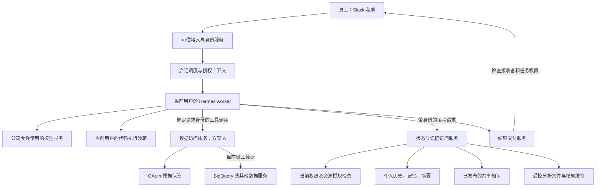
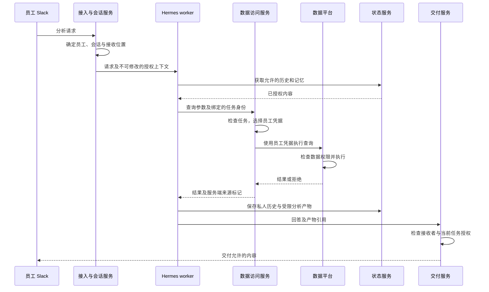
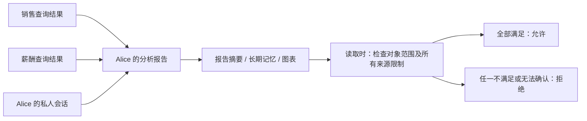
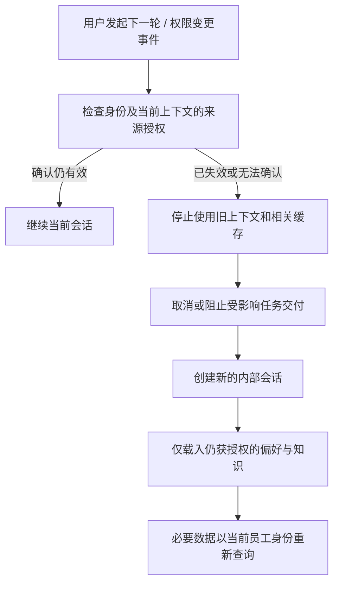

# 企业 Slack 数据分析 Agent：用户授权、记忆隔离与部署方案

> 文档状态：架构设计稿，供技术评审与实施拆分使用；文中拟议服务、接口和数据结构尚未实现。
>
> 编写日期：2026-09-25。Hermes 代码核对基线：`19201c61c0`。
>
> 当前选择：暂按方案 A，以员工自己的数据访问身份查询原始数据；同时独立建设历史、记忆和分析文件的访问控制。

阅读导航：

- [目标与已知条件](#1-目标与设计结论)：第 1—3 节。
- [方案选择与总体架构](#4-方案-a-与方案-b-的选择记录)：第 4—6 节。
- [方案 A 查询流程](#7-方案-a-的查询流程)：第 7 节。
- [记忆、派生内容与撤权](#8-会话长期记忆与共享知识)：第 8—11 节。
- [Slack 与部署策略](#12-slack-输出与共享频道)：第 12—13 节。
- [组件选型与 Hermes 改造](#14-可复用组件与选型边界)：第 14—15 节。
- [实施、验收与运维](#16-分阶段实施与迁移)：第 16—19 节。

四幅图使用 Mermaid 编写，可在支持 Mermaid 的 Markdown 阅读器中渲染。

## 1. 目标与设计结论

公司员工通过 Slack 与 Hermes 交互。系统必须根据实际请求人的权限提供数据分析，保证员工能够使用获准访问的数据集，并且不能通过查询、历史回忆、长期记忆、结果缓存或文件读取获得权限范围之外的数据。

建议采用以下架构：

1. 保留统一的 Slack bot 和接入服务，由可信代码识别员工。
2. 使用方案 A：数据访问服务根据员工绑定的 Google 授权提交查询，由数据平台执行原始数据访问控制。
3. 每位员工的会话、个人记忆和工作文件默认隔离；支持同一员工跨会话复用自己的记忆。
4. 共享知识通过独立的发布与读取机制管理，团队成员身份不能自动覆盖数据来源的权限限制。
5. 查询结果、摘要、图表、缓存和技能文件继承相关数据的访问限制；权限变化后重新检查。
6. 将能够执行模型生成代码的环境与凭据、跨用户状态存储、管理接口隔离。
7. 初期不按 bronze / silver / gold 固定拆多个完整 agent；根据执行隔离和敏感业务域的需要分配 worker 或独立部署。

方案 A 解决原始数据访问。它不会自动保护已经复制到 agent 系统中的数据。完整方案必须同时覆盖这两个环节。

## 2. 已知条件、假设与待确认事项

### 2.1 已知条件

| 条件 | 当前理解 |
|---|---|
| 数据位置 | 公司数据位于 GCP |
| 数据组织 | 平台有 bronze、silver、gold 等加工层 |
| 使用入口 | 员工通过 Slack 与 agent 对话 |
| 用户身份 | 每个 Slack 用户有唯一对应的 Google 账号，员工已进入正确的组 |
| 授权差异 | 不同员工获准访问的数据集不同 |
| 当前运行方式 | Hermes 运行在 GCP VM；当前 SA 能访问全部业务数据 |
| 当前决策 | 暂以方案 A 作为原始数据访问路径 |

### 2.2 设计中的假设

本文用 BigQuery 解释查询流程，但尚未确认你们所有数据都存放在 BigQuery。若实际包含 GCS、其他数据库或经由专有数据平台访问，需要为各数据源核对用户身份访问能力和授权语义。

方案 A 的关键前提是：员工在数据平台上的实际权限能够表达公司希望执行的访问范围。加入 Google 组并不自动意味着该组已获得对应数据集的 IAM 授权；上线前必须验证这条关系。

bronze / silver / gold 描述数据加工阶段。它们是否对应敏感级别、哪些员工能读哪些层，取决于公司的授权规则，不能假定权限按层递增或互相包含。

### 2.3 上线前需要确认

| 待确认项 | 对设计的影响 |
|---|---|
| 实际数据服务及访问方式 | 决定各连接器如何使用员工凭据 |
| Google 分组是否直接控制数据权限 | 决定方案 A 能复用多少现有授权 |
| 是否存在行级、列级、授权视图限制 | 决定派生结果能否在用户之间复用 |
| 员工原有权限是否包含写入或管理权限 | 决定 agent 额外需要限制哪些操作 |
| 第一版是否只允许私聊 | 决定共享频道的输出与历史回填复杂度 |
| 是否需要 Python、terminal、浏览器 | 决定执行环境与网络隔离要求 |
| 是否必须自动积累团队知识 | 决定共享记忆与来源追踪的实施优先级 |
| 权限撤销应在多久内生效 | 决定变更通知、权限检查和缓存策略 |
| 模型、记忆服务、日志的允许数据处理范围 | 决定可使用的服务与部署位置 |

## 3. 访问控制的范围与基本规则

### 3.1 需要保护的对象

原始数据之外，以下对象也可能包含业务数据：

- 当前会话的消息、工具结果和压缩摘要。
- 个人长期记忆、团队记忆、组织知识。
- 会话标题、搜索摘要、预览、历史导出。
- CSV、图表、Notebook、临时文件、工具输出落盘文件。
- 检索索引、向量记录、结果缓存和后台提炼任务。
- 自动生成的技能、分析脚本、示例数据和复用模板。
- Slack 回复、流式输出、附件、后台通知与定时报告。

是否需要授权取决于内容及其来源，不能由文件名或存储形式决定。数字被总结成自然语言以后，仍可能是受限数据。

### 3.2 必须保持的规则

| 规则 | 含义 |
|---|---|
| 身份可信 | 用户身份来自已验证的接入请求；模型提供的用户 ID、邮箱或 profile 名不能决定权限 |
| 读取前检查 | 未获授权的内容不得进入该用户的模型上下文 |
| 默认私人 | 新会话、个人记忆和分析产物默认属于当前员工 |
| 来源限制保留 | 派生内容不能因被摘要、嵌入或写入团队记忆而自动扩大可见范围 |
| 入口完整覆盖 | 搜索、直接读取、列表、恢复、翻页、下载和后台任务均执行授权 |
| 当前权限有效 | 曾经有权限不代表今天仍能通过 agent 读取旧结果 |
| 无旁路 | terminal、文件工具、其他连接器和管理命令不能绕过上述控制 |
| 正向能力可用 | 测试既要证明拒绝越权，也要证明合法数据分析仍然成功 |

本设计控制系统主动提供的数据访问。已经合法交付到 Slack 或被员工下载的内容，不能靠后续撤权追回；基础设施管理员的访问也需要由基础设施权限单独管理。

## 4. 方案 A 与方案 B 的选择记录

### 4.1 两种方案的区别

| 比较 | A：员工身份查询 | B：授权代理以 SA 查询 |
|---|---|---|
| Slack 入口 | 保留 | 保留 |
| 数据服务看到的身份 | 员工本人 | 代理使用的 SA |
| 原始数据权限判断 | 数据平台依据员工权限执行 | 代理依据员工授权规则执行，数据平台再检查 SA 权限 |
| 主要建设工作 | 用户绑定、凭据保管、按请求选取凭据 | 权限规则、查询约束、受控执行、规则同步 |
| 自由 SQL | 可复用数据平台对引用资源的检查 | 必须可靠限制所有数据访问路径，复杂度较高 |
| 用户体验 | 首次可能需要 OAuth 绑定及后续重新授权 | 通常无需逐人 Google OAuth 绑定 |
| 审计 | 数据平台以员工身份处理操作；应用仍记录 Slack 请求关联 | 必须将 SA 操作与实际员工建立可信关联 |
| 历史与记忆权限 | 仍需另外实现 | 仍需另外实现 |

当前优先 A，是因为公司已有员工 Google 账号和分组，可以争取复用已有数据授权。这个选择需以实际 IAM 权限核对结果为依据。

若某数据源不支持合适的员工身份访问方式，或者公司希望 agent 执行一套独立的数据访问规则，可以对该数据源采用 B。混合接入时，不能将 A 查询失败后自动改用高权限 SA 重试。

### 4.2 SA 与员工身份的关系

VM 附加 SA 是运行环境可取得的一种身份，并不强制所有 API 请求都使用它。BigQuery 客户端可以显式传入员工凭据；未指定时才按默认凭据机制寻找可用身份。[客户端参数](https://docs.cloud.google.com/python/docs/reference/bigquery/latest/google.cloud.bigquery.client)、[默认凭据查找机制](https://docs.cloud.google.com/docs/authentication/application-default-credentials)。

因此，方案 A 需要改变当前查询路径，并移除模型执行环境对全数据 SA 的使用能力。只给正常查询工具加员工 token，同时保留可随意调用的全数据 SA，不能形成访问边界。

可以保留低权限的运行 SA，用于服务调用、日志等必要功能。业务查询以员工凭据执行。服务账号模拟产生的是目标 SA 的权限，不会自动保留员工的数据权限。[Google SA 模拟说明](https://docs.cloud.google.com/iam/docs/service-account-impersonation)。

## 5. 总体架构与信任边界



图中是逻辑组件，不要求每个组件单独部署一个服务。执行模型生成代码的部分，与持有跨用户凭据或全部状态访问权的部分，需要通过实际的权限、文件系统及网络边界隔离。仅拆成同一 Unix 用户下的两个进程，不足以保证隔离。

| 组件 | 可以掌握的权限 | 必须限制的行为 |
|---|---|---|
| Slack 接入与身份服务 | Slack 接入凭据、员工映射、请求身份签发 | 不把用户文本当身份；不把管理凭据交给 worker |
| 会话调度 | 创建与绑定用户会话、分配 worker | 不把 Alice 的活动上下文复用给 Bob |
| Hermes worker | 当前用户、当前任务的受限服务访问能力 | 不取得其他用户凭据、全库数据库密码或跨用户目录 |
| 数据访问服务 | 按员工查找 OAuth 凭据并提交查询 | 不接受 worker 任意指定另一个员工；不以高权限身份回退 |
| 状态与记忆服务 | 受控读写历史、记忆、文件元数据 | 每种操作执行资源授权；不暴露任意数据库查询接口 |
| 代码执行沙箱 | 当前用户获准使用的数据与工作文件 | 不访问宿主机凭据、其他用户文件或控制服务的管理接口 |
| 结果交付服务 | 向已绑定的接收位置发送内容 | 不允许模型任意改变敏感结果的接收人或频道 |

可信服务本身可能需要访问多位员工的记录。这种权限只属于服务端实现；模型和用户不能通过工具参数、脚本或文件读取取得同等权限。

## 6. 身份绑定与请求上下文

### 6.1 员工标识

入口至少使用 Slack workspace ID 与 user ID 的组合，再映射到稳定的内部员工 ID。不要使用可修改的显示名作为主键，也不要把“用户名写在提示词里”视为认证。

HTTP 接入应验证 Slack 请求；Socket Mode 应通过已认证连接接收事件，并核对所属 workspace。两者的接入机制不同，应用取得可信员工身份后的授权规则相同。[Slack 请求验证](https://docs.slack.dev/authentication/verifying-requests-from-slack/)、[Socket Mode](https://docs.slack.dev/tools/bolt-python/concepts/socket-mode)。

第一版只开放与已映射员工的私聊。未知用户、已停用员工、缺少 workspace 归属或账号绑定冲突的请求，不进入数据分析流程。

### 6.2 可信请求上下文

以下为拟议数据结构，不是 Hermes 当前已有的配置字段：

```json
{
  "organization_id": "company-1",
  "subject_id": "employee-alice",
  "slack_workspace_id": "T_EXAMPLE",
  "slack_user_id": "U_ALICE",
  "session_id": "session-123",
  "run_id": "run-456",
  "authorization_revision": "local-revision-42",
  "reply_target": {"kind": "slack_dm", "id": "D_ALICE"}
}
```

上下文由入口创建并由服务端传递。跨服务调用可使用短期、限定接收服务和会话的签名凭据；worker 无权签发任意用户的凭据。模型只提供查询或分析参数，不能修改 `subject_id`、授权版本或结果接收者。

`authorization_revision` 是本系统维护的版本标识，不能假定 Google IAM 自动提供一个覆盖所有权限的统一版本号。如何感知外部权限变化，见第 11 节。

后台任务、记忆提炼、子任务、定时执行和失败重试都携带相同的员工及来源上下文，并在实际执行时检查权限。身份缺失时停止相关操作，不回退到默认员工或默认 profile。

## 7. 方案 A 的查询流程

### 7.1 首次账号绑定

员工在 Slack 收到绑定入口，完成 Google OAuth。回调校验授权流程状态与 Google 账号身份，并确认它对应当前 Slack 员工。已有的企业账号映射可用于验证绑定关系，但邮箱映射本身不是可用于调用数据 API 的凭据。

刷新凭据由独立服务保管。Hermes 的提示词、工作目录、日志和代码沙箱不接触它。授权过期、被撤销或需要重新认证时，向员工返回重新绑定入口，不换用 SA 绕过。[Google 服务端 OAuth 流程](https://developers.google.com/identity/protocols/oauth2/web-server)。

### 7.2 正常查询



以 BigQuery 为例，员工需要在查询执行项目上拥有创建 query job 的权限，并对查询涉及的数据拥有相应读取权限。授权视图可以允许员工读取视图，而无需直接读取底层表。[BigQuery 查询权限](https://docs.cloud.google.com/bigquery/docs/running-queries)、[授权视图](https://docs.cloud.google.com/bigquery/docs/authorized-views)。

查询项目由服务配置选择；凭据选择与项目选择分别管理。不能因为请求来自某个项目，就认为它具有该项目全部权限。

### 7.3 数据服务必须覆盖的操作

数据集发现、表结构读取、查询提交、轮询 job、读取结果、下载或导出都需要绑定员工身份。不能只给“提交查询”加授权，而允许其他人拿一个 job ID 读取其结果。

服务返回给 worker 的结果引用应绑定当前员工和任务。原始 job ID 可以作为内部审计信息，但不能作为不检查所有者的通行证。

原始数据权限与 agent 的操作范围是两层限制。即使员工本人有写表或管理权限，第一版分析 agent 仍可只开放约定的只读操作。脚本、存储过程、远程函数、外部连接、导出目的地等能力，需在开放前明确其行为；不能仅用 SQL 以 `SELECT` 开头来证明没有其他影响。

### 7.4 移除当前高权限 SA 旁路

从 Hermes worker、terminal、文件工具和可运行用户代码的环境中移除全数据 SA 的可达性。不能将它的 key 文件、可模拟它的权限或可取得它 token 的 metadata 路径暴露给这些环境。

如果当前 VM 上还有必须使用该 SA 的可信工作负载，应拆分工作负载，而不是只改 Hermes 的默认客户端。Google 文档明确指出，VM 上运行的代码通常能够通过 metadata server 获取附加 SA 的 token。[SA 安全建议](https://docs.cloud.google.com/iam/docs/best-practices-service-accounts)。

## 8. 会话、长期记忆与共享知识

### 8.1 会话归属

会话主键需明确包含组织和员工身份，并与 Slack 对话位置绑定。Slack thread ID 只能标识对话位置，不能替代员工身份或数据权限。

第一版采用私人会话：同一员工可以继续自己的会话或新建会话，不同员工不能共享活动模型上下文。`/new` 结束当前会话不会删除合法的个人长期记忆；新会话加载记忆时仍要检查权限。

恢复、搜索和直接读取历史都必须检查归属，包括标题、摘要、消息数等元数据。知道 session ID 或 profile 名不代表有权读取。

### 8.2 记忆分类

| 类别 | 示例 | 保存与复用方式 |
|---|---|---|
| 个人偏好 | 输出语言、图表习惯、常用时区 | 按员工长期保存；其他员工不可读 |
| 个人工作记录 | 某次分析目标、未完成事项 | 私人；引用业务数据时保留来源限制 |
| 数据分析结果 | 某客户亏损额、某部门人均薪酬 | 私人保存或短期缓存；读取时检查来源权限 |
| 分析方法 | 指标定义、参数化查询模板、排错步骤 | 默认私人；经有权发布者确认后可进入指定共享范围 |
| 团队知识 | 团队口径、已发布流程 | 检查团队范围；受限数据还要检查来源权限 |
| 组织知识 | 适用于全公司的业务规则 | 由有发布权限的维护者管理，版本化发布 |

“方法”不必然无敏感信息。表名、SQL 常量、注释、示例客户和业务逻辑本身都可能受限。不得因为某条记忆被模型分类为“通用经验”，就自动解除其来源限制。

### 8.3 自动记忆与知识发布

自动提炼的记忆默认留在当前员工范围内。向团队或组织发布是一项独立操作，要求发布者具有相应权限，并明确内容的来源与允许读者。

员工有权查询某个数据集，不代表有权把该数据集的内容发布给更多人。需要扩大可见范围的汇总报告，应由既有的数据发布政策确定其新权限；LLM 的“这已经脱敏”不能独立构成授权。

共享知识应保持版本和撤回记录。与它相关的个人记忆可以引用已发布知识的 ID，避免把共享文本反复复制后失去版本和权限关联。

### 8.4 内置文件记忆的处置

在多用户共用 profile 的模式下，不再让内置共享 `USER.md` 承载员工画像，也不让共享 `MEMORY.md` 自动吸收个人分析。

可选择两条实现路线：

| 路线 | 做法 | 适用情况 |
|---|---|---|
| 外置受控记忆服务 | 关闭相应的内置共享内容加载与自动写入，通过 memory provider 接入个人记忆和已授权共享知识 | 希望集中管理、检索和撤销，推荐作为长期方向 |
| 用户独立状态目录 | 每位员工独立 profile 或状态目录，外加实际文件系统隔离；共享知识单独只读提供 | 初期用户较少，希望保留较多现有文件记忆逻辑 |

关闭写入不等于关闭读取；关闭一个 memory 工具也不等于禁止文件工具读取旧文件。配置切换后，已经加载旧共享内容的活动会话需要重建。

## 9. 派生数据的来源与权限

### 9.1 拟议资源模型

以下结构表达设计需求，不要求所有后端采用相同表结构：

```json
{
  "resource_id": "artifact-789",
  "kind": "analysis_summary",
  "organization_id": "company-1",
  "owner_subject_id": "employee-alice",
  "audience": {"type": "private", "subject_id": "employee-alice"},
  "source_refs": ["query-result-123", "private-session-456"],
  "source_policy_refs": ["approved-sales-view-scope"],
  "created_under_revision": "local-revision-42",
  "state": "active",
  "content_ref": "private-object-789",
  "retention_class": "analysis-result"
}
```

`source_refs` 用于追踪派生关系，`source_policy_refs` 表达读取时需要检查的来源访问范围。内容归属、来源和策略引用由服务端创建或验证，不能由模型自行去掉。

授权视图场景中，应记录“通过哪个获准视图和查询范围取得内容”，不能一概要求员工拥有底层表的直接权限，否则会错误拒绝合法访问。来源资源名称、读取范围及其验证方式需要由数据连接器明确表达。

### 9.2 读取规则

对于包含受限数据的对象，可用以下规则描述默认读取条件：

```text
允许读取 =
    同一组织
    且 满足对象自己的所有者或共享范围
    且 满足全部相关来源的当前访问限制
    且 对象未撤回、未过期、未因权限变化待验证
```

例如，Alice 的私人报告来源于销售和薪酬两个数据范围。Bob 即使有销售权限，也不能读取；即使他同时有这两个数据范围的权限，仍需获得该私人报告本身的共享授权。

多来源内容通常需要同时满足各来源限制，不能简单把来源标签按“匹配任意一个即允许”处理。



### 9.3 权限继承与保守处理

压缩、摘要、记忆提炼、图表生成和技能创建都传播来源限制。提炼任务自身也应按用户和允许范围组织，避免先把多个用户的内容混合，再尝试分配权限。

无法可靠确定一句总结使用了哪些输入时，继承生成它时相关上下文的全部限制。必要时把完整会话作为来源。这样会降低共享范围，但不会依赖模型准确解释自己的信息来源。

个人偏好等低敏信息可以通过独立、明确的输入流程更新。不能从已经含敏感业务结果的上下文中提炼一句“偏好”，就默认它与业务数据毫无关系。

### 9.4 重新查询与缓存复用

推荐第一版优先保存分析方法、查询引用和个人工作连续性，业务数值需要时按当前员工身份重新取得。

对于行级或列级权限：Bob 能查询某张表，并不能证明 Bob 能看到 Alice 当时查询到的那些行和列。一次当前查询成功，也不能证明旧结果中的所有内容仍可交付。

无法证明旧结果与当前授权范围相容时，不返回旧值；重新执行适用于当前员工的查询，并基于新结果重新生成回答。仅做 SQL dry run、检查表是否存在或检查 dataset 可见性，不足以证明旧结果可复用。

## 10. 检索、文件、技能与后台任务

### 10.1 统一授权入口

记忆与历史至少覆盖以下入口：

- 关键词、向量或混合搜索。
- 按 ID 读取、消息翻页、最近会话列表。
- 会话恢复、`@session` 等引用展开、导出与预览。
- 自动 recall、后台摘要、压缩前保存、会话结束提炼。
- 文件下载、结果链接、附件、共享知识引用。

可以先在可信后端搜索候选对象，再检查权限；也可以先限定允许的对象集合再检索。未授权内容必须在交给主模型、摘要模型或其他参与生成的模型之前被过滤。[OpenFGA 的搜索授权模式](https://openfga.dev/docs/interacting/search-with-permissions)。

对不存在和无权访问的对象，向普通用户提供适当的一致响应。标题、摘要、搜索计数和文件名也应遵守资源授权，避免正文被拒绝但元数据泄露。

### 10.2 工作文件与大输出

每个 worker 只挂载当前用户获准使用的工作文件。通用代码、公共技能可以只读共享；个人结果、浏览器下载、临时目录和 Python 缓存不能默认跨用户复用。

Hermes 会将大段工具结果写入 profile 的 spillover 目录，因此必须把这条路径纳入用户范围，或改为受控对象服务并使用授权结果引用。只隔离最终 CSV 文件不够。

仅为 terminal 配置容器也不代表全部文件访问已经被隔离。需核对文件工具、附件解析、上下文引用、宿主机 hook 和缓存同步是否仍能访问宿主机的跨用户目录。

### 10.3 Skills 与复用脚本

自动生成的技能和脚本默认私人。共享技能库只接受明确发布的内容，并以只读形式提供给普通 worker。

例如，不能把含真实客户名单的成功查询示例保存成一个所有员工都会加载的 skill。复用算法时应使用占位参数或已允许公开的示例，并保留必要的资源访问约束。

### 10.4 异步与委派

异步回调、重试、记忆提炼、委派子任务和定时报告都绑定原始员工、任务、来源及接收位置。执行时和交付时重新确认权限，不能只依赖创建任务时的检查。

队列中的任务被撤销后，不得通过晚到的回调写入可读取记忆或发送旧结果。任务状态、来源版本和授权版本应参与提交判断。

### 10.5 缓存与索引

业务结果缓存不能只用 SQL 文本或问题文本作为键。缓存至少区分员工或经过验证的可共享范围、查询参数和相关数据范围；命中后仍检查当前授权。相同问题由不同员工提出，不代表可以返回相同结果。

检索索引中的每个切块都要关联原始对象的权限。删除、撤回和权限变化要覆盖正文、向量记录、预览及摘要；索引更新尚未完成时，由读取入口阻止失效对象被返回。

模型服务的会话恢复标识及本地模型上下文也只能绑定对应员工和会话。基础模型和公共提示词可以共享，包含业务内容的会话状态不能因 worker 复用而串用。

## 11. 权限变化与旧上下文

### 11.1 个人隔离不解决撤权

Alice 昨天有薪酬权限，今天失去权限。即使所有历史都只属于 Alice，agent 仍可能从她自己的旧会话中回答薪酬问题。因此，必须同时处理用户隔离和权限随时间变化。

### 11.2 权限新鲜度

需要记录或获取以下变化：员工停用、组成员变化、资源 IAM 变化、行列策略变化、共享范围变化和内容撤回。

不能仅靠员工登录时缓存一次分组。也不能假定所有 Google 权限变化都能立即同步到本系统。上线前应选择可用的变更通知、读取时检查和有界缓存方式，并明确撤销生效时间。

本地 `authorization_revision` 用于使已知失效的状态停止使用；它不能掩盖未被感知的外部变更。来源检查没有足够新鲜的信息时，受限缓存暂停返回；必要时通过当前员工身份重新取数。

对于需要更复杂共享关系的阶段，可以采用支持一致性检查的授权服务。SpiceDB 提供权限检查的一致性选项，用于避免过期授权缓存导致错误放行。[SpiceDB 一致性文档](https://authzed.com/docs/spicedb/concepts/consistency)。

### 11.3 活动会话处理



旧内容已经进入模型上下文时，不能仅在新一轮提示词里告诉模型“忘掉它”。应关闭该内部会话，并从仍允许使用的内容建立新会话。Slack 入口可以保持不变。

如果缺少足够可靠的权限变更检测，不能宣称可安全长期复用含敏感数据的活动上下文。保守模式是在相关轮次重建上下文，并重新取得业务数据，直到具备能够验证旧上下文的机制。

Hermes 的系统提示词在会话生命周期内应保持稳定。上述处理通过新建会话完成，不在原会话中悄悄修改系统提示词或保留受限摘要继续生成。

## 12. Slack 输出与共享频道

### 12.1 第一版交付方式

敏感分析结果默认发到当前员工与 bot 的私聊。频道中的请求可以引导到私人分析流程，公开频道只返回不包含业务结果的状态信息。

结果交付范围覆盖最终文本、流式片段、图表、附件、工具进度、错误信息和后台通知。不能先向频道流式输出敏感内容，再在最终答案时检查权限。

### 12.2 共享频道扩展

共享频道中的发言人获准查询，不代表频道所有成员获准查看结果。未来开放共享分析时，需要确定接收者范围、频道成员变化和 Slack 历史可见性的管理规则。

可选择：只发布该受控频道允许的数据；或者公开消息只放受控结果链接，打开链接时逐用户检查权限。后一种方式仍需保证链接标题和预览不泄露数据。

不能只检查“发送当时的成员”。后来加入频道的人可能看到历史消息，因此频道的长期访问政策必须与被发布内容的权限兼容。

### 12.3 thread 历史回填

设置按用户区分 thread 会话后，仍需处理 Slack 适配器从 thread 恢复旧消息的路径。第一版私人分析不自动导入其他人的 thread 历史；共享模式只有在频道与内容权限规则明确后才开放回填。

Slack 可见性与公司数据权限是不同条件。数据一旦已经错误地公开在频道中，后续 agent 过滤不能撤销此前的披露。

## 13. 部署策略：是否需要多 agent

### 13.1 区分四种“多个”

| 形式 | 解决的问题 | 能否单独保证数据授权 |
|---|---|---|
| 多个 Slack bot | 不同使用入口与交互体验 | 不能 |
| 多个 Hermes profile | 配置、状态目录、记忆和日志的组织隔离 | 不能替代文件系统及接口授权 |
| 按用户或会话分配 worker / 沙箱 | 活动上下文、代码执行和文件的隔离 | 还需要数据与状态服务授权 |
| 多个完整部署与独立凭据 | 更大的故障隔离、管理边界或敏感域隔离 | 部署内用户权限不同仍需逐用户控制 |

Hermes 文档明确说明 profile 不提供文件系统沙箱。共享 Unix 用户下的本地 terminal 仍可能访问 profile 之外的目录。[本地 profile 文档](../../website/docs/user-guide/profiles.md)。

### 13.2 推荐拓扑

第一版采用一个面向员工的 Slack 入口，可信接入与调度服务可以共享。包含业务上下文的 worker、可执行代码的沙箱及其文件按用户或会话隔离；个人记忆通过受控状态服务跨会话保存。

不要求每位员工常驻一台 VM。可以按请求创建或复用严格绑定某位员工的 worker，回收前清理运行状态。不能把仍持有 Alice 上下文、文件或凭据的 worker 直接交给 Bob。

当某些数据域要求独立管理、独立网络、独立模型供应商或更强的故障边界时，再为这些域建立独立部署。同一员工可以被可信入口路由到多个环境，但其实际可访问数据仍由授权决定。

不能直接按 bronze / silver / gold 三个 agent 授权所有员工。例如 Alice 可读 X、Y，Bob 可读 Y、Z，一个固定拥有 X、Y、Z 的 agent 无法仅靠分组入口满足两人的精确权限。

## 14. 可复用组件与选型边界

以下方案是候选实现或设计参考，不代表必须引入全部产品，也不表示安装后无需改造 Hermes。

| 组件或模式 | 可以承担的职责 | 选型时要核对 |
|---|---|---|
| PostgreSQL 行级安全 RLS | 对个人历史、记忆及资源元数据强制限制读写 | 服务角色不能用超级用户或 `BYPASSRLS`；表所有者默认绕过 RLS，必要时使用 `FORCE ROW LEVEL SECURITY`；可信身份不能被客户端改写 |
| OpenFGA | 用户、团队、资源共享关系及搜索授权 | 授权关系的权威来源、所有读取入口、搜索与权限结果的结合方式 |
| SpiceDB | 复杂关系授权、权限变更一致性 | 数据与授权版本的一致性、缓存策略、变更传播 |
| Hindsight | 按 bank 组织记忆、提炼与召回 | 单 bank 查询范围不等于调用者只能访问该 bank；需核对凭据范围及部署版本 |
| AWS AgentCore Memory | actor / session / namespace 的记忆组织与操作授权 | 各 API 是否都受所需粒度的限制、是否可绕过 gateway |
| Azure AI Search 权限过滤模式 | 将权限信息随文档、切块进入索引，并在检索时过滤 | 权限同步、切块继承、预览功能的适用范围 |
| Hermes 现有 memory provider 接口 | 将当前员工上下文带入外部记忆服务 | 它不会自动覆盖内置文件记忆、历史数据库或工具缓存 |

相关依据：

- [PostgreSQL RLS](https://www.postgresql.org/docs/current/ddl-rowsecurity.html) 明确列出默认拒绝与绕过 RLS 的角色条件。
- [OpenFGA 搜索授权](https://openfga.dev/docs/interacting/search-with-permissions) 说明先搜索后检查、先取允许对象再搜索等模式。
- [Hindsight Cloud 官方说明](https://hindsight.vectorize.io/blog/2026/09/03/hindsight-cloud-enterprise-features) 提供限定 bank 的凭据；不能据此假定所有自托管版本具备相同能力。
- [AgentCore Memory 细粒度授权](https://docs.aws.amazon.com/bedrock-agentcore/latest/devguide/memory-gateway-fgac.html) 包含按身份、namespace 的控制，并说明批量操作的粒度限制。
- [Azure AI Search 文档级权限](https://learn.microsoft.com/en-us/azure/search/search-document-level-access-overview) 区分通用安全过滤和处于预览阶段的原生权限集成。

初期规则以个人所有者和少量共享范围为主时，可先使用一个受控状态服务和关系数据库，不必立即引入复杂权限图。共享关系增多后，再评估 OpenFGA 或 SpiceDB。

若选记忆产品，优先验证它能否强制限制调用者范围，而不只验证 `user_id`、namespace 或 tag 是否能过滤结果。

## 15. Hermes 现状与改造清单

以下为本地代码静态核对结果，不是对线上 Slack / GCP 配置的完整审计。文件定位以文档开头的提交为准。

| 当前路径 | 已核对的行为 | 需要完成的改造 |
|---|---|---|
| [tools/memory_tool.py](../../tools/memory_tool.py)，`get_memory_dir()`，约第 38 行 | 内置记忆位于 profile 的 memories 目录 | 用户独立存储或替换为受控服务；处理读取与写入两条路径 |
| [agent/agent_init.py](../../agent/agent_init.py)，`_init_memory()`，约第 1259 行 | 初始化时加载内置记忆；外部 provider 与其并存 | 明确禁用或收敛旧共享内容，不仅切换 provider |
| [tools/memory_tool_store.py](../../tools/memory_tool_store.py)，`load_from_disk()` | 内置记忆形成固定的提示词快照 | 迁移和撤权后重建受影响会话 |
| [tools/session_search_tool.py](../../tools/session_search_tool.py)，`_discover()`、`_dispatch()` | 有搜索、最近列表、按 ID 读取与翻页路径；未按当前 Slack 用户过滤 | 在服务或存储边界统一实施主体与对象授权 |
| 同文件的 `_resolve_profile_db()`，约第 434 行 | 可显式打开其他可访问 profile 的 state.db | 禁止普通员工通过 profile 参数扩大访问范围 |
| [agent/inline_tool_executors.py](../../agent/inline_tool_executors.py)，`_session_search()` | 传入当前 session ID 与 DB，未传入用户授权策略 | 将可信员工上下文传至所有历史读取路径 |
| [gateway/session.py](../../gateway/session.py)，`build_session_key()`，约第 673 行 | thread 会话默认可共享 | 私人模式使用用户隔离键，并校验会话归属 |
| [Slack adapter](../../plugins/platforms/slack/adapter.py)，`_hydrate_thread_context()`，约第 4206 行 | 从 thread 读取历史并补充上下文 | 回填需遵守私人或共享模式的授权规则 |
| [tools/tool_result_storage.py](../../tools/tool_result_storage.py)，`get_spillover_dir()`、`maybe_persist_tool_result()` | 大输出写入 profile 的 cache/spillover | 按用户隔离，或使用受控产物存储 |
| [Mem0 provider](../../plugins/memory/mem0/__init__.py)，`initialize()`、`_search()` | 可使用 gateway user_id；显式配置的固定 user_id 优先 | 不将所有员工配置到同一用户；使用规范员工身份并验证后端授权 |

除了表中入口，实施时还需追踪会话引用、恢复命令、文件引用、附件、自动 skills、后台任务和管理命令的真实调用路径。不能只对工具名做过滤而忽略同一内容的其他读取方式。

### 15.1 与项目扩展方式保持一致

优先通过已有 memory provider、插件和受控数据服务接入能力。供应商专属集成放在独立插件仓库；确实缺少通用身份或授权上下文时，再对 Hermes 增加有明确消费者的通用接口。

不要把逐用户权限判断放入进程级 `check_fn` 或全局环境变量。并发员工的身份、凭据选择和状态范围必须随请求绑定。

profile 的 ContextVar 隔离可复用，但它不是完整的员工授权机制。后台线程、子进程、回调和退出清理都必须保留相应上下文；仍需证明不存在跨员工读取路径。

## 16. 分阶段实施与迁移

### 阶段 0：确认权限事实

核对真实数据服务、员工到 Google 账号的映射、组到资源的授权，以及是否存在行列限制。用至少两个权限不同的测试员工验证：以员工凭据查询时，获准资源可读，未获准资源被拒绝。

同时清点当前 Hermes 的共享记忆、state.db、spillover、工作文件、skills、OAuth 凭据和可用连接器。确定私人首发范围、数据保留周期与权限撤销生效要求。

完成条件：目标权限能够由数据平台准确表达，或者已明确哪些数据源需要转入 B 方案。

### 阶段 1：私人分析与个人长期记忆

实现 Slack 身份绑定、方案 A 数据访问服务、用户隔离的会话与执行环境。将个人长期记忆接入受控存储，同时关闭旧共享记忆加载及未受控历史入口。

保留个人偏好、个人工作连续性和私人分析历史；共享业务知识先以维护者发布的只读内容提供。结果只交付私聊。设置权限变化后的上下文重建策略。

完成条件：第 17 节中适用于私人模式的访问、隔离、撤权和并发测试通过；合法分析可以完成。

### 阶段 2：受控共享知识

实现对象共享范围、来源关系、发布与撤回、派生内容权限继承。允许员工共享获准发布的方法和知识；业务值优先重新查询。

完成条件：团队成员中权限较低者无法通过共享摘要取得受限来源；发布和撤回对索引、缓存及活动会话生效。

### 阶段 3：扩展协作与执行能力

按实际需求开放受控频道、定时报告、跨会话分析、更多数据源或敏感域独立部署。每增加一个入口，同时覆盖其读取、持久化、异步执行和输出路径。

完成条件：新增能力没有扩大既有访问范围，且保留对应的端到端测试。

### 旧状态迁移

来源和所有者可证明的记录迁移到相应用户或共享资源。无法证明归属的旧共享内容先移出自动加载、检索和工具可读范围，交由维护者确定归属；不要默认标记为全员可见。

迁移后重建已经加载旧内容的活动会话。旧数据库、备份和缓存即使为恢复目的保留，也不能继续挂载到普通 worker。

回滚可以暂停受影响功能或恢复上一版已验证的受控实现，不能以重新开放全数据 SA 或旧共享记忆作为生产回退路径。

## 17. 验收标准

使用隔离的测试数据与测试账号执行验证。为 Alice 独有数据放入唯一测试标记，使泄漏可以被确定识别；不能只判断模型是否说了“我没有权限”。

| 编号 | 场景 | 预期结果 |
|---|---|---|
| T01 | Alice 查询允许的数据 | 成功，并能追踪到员工身份与查询 job |
| T02 | Bob 查询 Alice 独有的数据 | 数据平台拒绝；不回退到 SA |
| T03 | 用户在文本或工具参数中声称自己是 Alice | 实际身份不变 |
| T04 | Bob 搜索 Alice 的私人历史或记忆 | 内容、标题和摘要均不返回 |
| T05 | Bob 提供 Alice 的 session ID、memory ID、profile 名或翻页参数 | 与搜索路径相同地拒绝 |
| T06 | Alice 的长查询结果触发 spillover | Bob 的文件工具和 terminal 无法读取 |
| T07 | 两人在同一个 Slack thread 交互 | 不复用彼此的私人模型上下文；回填不绕过策略 |
| T08 | 敏感结果被压缩、提炼成 memory 或写入 skill | 派生内容继续受原有范围限制 |
| T09 | 团队记忆同时来源于销售和薪酬 | 只有销售权限的成员无法读取 |
| T10 | 两人可查询同一张表但拥有不同的行级范围 | 不复用另一人的旧结果；当前身份重新取数 |
| T11 | Alice 被撤销访问权限后继续旧会话 | 在约定生效范围内，旧上下文、缓存和记忆不再提供受限内容 |
| T12 | 撤权时有查询、记忆提炼或通知在队列中 | 受影响任务不继续写入可读内容或交付结果 |
| T13 | 两用户并发，以及 Alice → Bob → Alice 交替运行 | 无身份、凭据、上下文、结果或文件串用 |
| T14 | OAuth 过期或撤销，记忆权限服务不可用 | 请求重新授权或拒绝相应读取，不以更宽权限回退 |
| T15 | 模型试图读取宿主机凭据、其他用户目录或 metadata token | 执行环境与服务授权阻止访问 |
| T16 | 私人偏好在新会话中复用 | 当前员工正常读取，其他员工不可读取 |
| T17 | 发布合法共享知识并随后撤回 | 获准员工可读；撤回后检索与缓存按策略失效 |
| T18 | 频道回复、流式片段、附件、错误或后台消息 | 不向未经授权的接收位置发送敏感内容 |
| T19 | 重启服务、恢复会话或重建索引 | 用户归属与授权检查保持有效，不因临时进程状态丢失而放行 |
| T20 | 修改或删除别人创建的记忆、文件、共享知识 | 写权限检查阻止；合法所有者操作仍可用 |

检查应覆盖进入模型的上下文和工具返回值，不能只检查最后的自然语言回答。查询数据源授权需要在测试 GCP 资源上验证；本地 mock 不能证明 IAM 配置正确。

实现 Hermes 代码后使用项目要求的 `scripts/run_tests.sh`，对真实调用链使用临时状态目录；涉及 profile 的测试覆盖两套 home 的交替访问。本文档本身不代表这些实现或验收已经完成。

## 18. 运维职责与观测

| 责任 | 主要事项 |
|---|---|
| 数据平台团队 | 数据集与行列权限、组到资源映射、数据发布规则 |
| 身份管理团队 | Slack 与员工账号映射、入离职、组成员维护、变更传播 |
| Agent 平台团队 | 请求身份传递、OAuth 凭据、会话隔离、工具边界、结果交付 |
| 知识维护者 | 共享内容发布范围、版本、来源与撤回 |
| 基础设施团队 | worker 隔离、网络、SA 最小权限、密钥与备份访问 |

审计至少关联员工 ID、Slack 请求、session、run、查询 job、读取的状态资源、授权决定、策略版本和交付位置。不要把 refresh token 或完整敏感结果写进普通日志。

监控未知身份、越权读取、跨 profile 请求、异常凭据回退、撤权处理延迟及缓存失效失败。合法访问大量被拒绝同样需要处理，因为系统目标包括员工能够完成权限范围内的分析。

上线评审需要给出具体的权限撤销生效要求，并同时评估数据平台传播时间和应用缓存时间；在这些条件未确定前，不承诺权限变更瞬时生效。

## 19. 当前决策与后续评审清单

| 状态 | 项目 |
|---|---|
| 已确认目标 | 每位 Slack 员工只能通过 agent 获取其获准访问的数据，包含派生内容 |
| 暂定 | 原始数据访问采用方案 A |
| 建议第一版采用 | 私聊、用户隔离会话、个人长期记忆、受控状态服务、隔离执行环境 |
| 建议第一版采用 | 共享知识只接受明确发布；数据值优先按当前员工重新查询 |
| 不作为授权依据 | 单纯的 bronze / silver / gold 层名、Slack 频道成员身份、profile 名、模型填写的 user_id |
| 尚待验证 | 实际数据源、现有组与数据 IAM 的对应、行列限制及用户 OAuth 可用性 |
| 尚待选择 | 记忆后端、权限服务是否需要专用组件、执行沙箱技术 |
| 尚待确定 | 撤权生效要求、保留周期、共享频道策略、允许的数据处理服务 |

下一次技术评审应先拿两个真实权限不同的测试员工验证方案 A，再确定私人状态服务和 worker 隔离的具体实现。只有这两条路径都得到验证，才进入自动共享记忆和多人频道协作的扩展。
