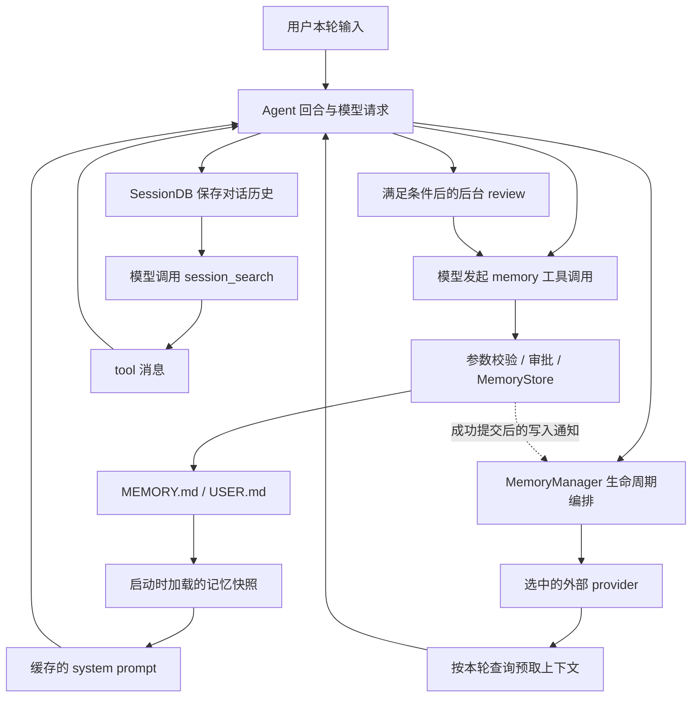

# Hermes Memory 系统学习计划

返回[学习总览](../README.md) · [本模块入口](README.md) · [学习笔记](notes.md)。

编写日期：2026-09-29。源码核对基线：`308f2d8806`。本文是待执行路线，助手为编写计划阅读源码不计入用户学习进度。后续以 `notes.md` 的最新检查点恢复；更新仓库后按符号重新定位，不能把历史行号或旧 `/tmp` 目录当作当前事实。

## 最终目标与范围

从“Agent 为什么能在新会话记得某件事”开始，最终能结合当前代码解释信息的完整生命周期：**来源 → 判断是否保存 → 写入 → 存储 → 检索或加载 → 进入请求 → 更新、失效与会话结束**。遇到“忘记、记错、串 profile、写了却未生效”时，能定位到具体层次，并用可复现实验证据验证。

“完全理解”以这些可验收能力为准，不以读完文件数量为准：

- 画出内置文件记忆、会话历史、外部 provider、Skills、上下文压缩的关系，指出它们各自拥有的数据。
- 跟通内置 `memory` 工具的参数、调度、审批、整条 entry 的修改、落盘与下一会话加载。
- 解释冻结的 system prompt、当前可修改的 store、磁盘文件、历史消息、模型实际请求之间的区别。
- 区分前台模型判断、周期后台 review、provider 的逐轮同步和会话结束提取；分别验证触发、执行和结果。
- 跟通 `session_search` 的数据库查询路径，以及 provider 的预取、工具调用、写入桥接和资源释放。
- 解释压缩、`/new`、恢复、分支、退出、profile、群聊身份和子代理对记忆的影响。
- 精读一个本地 provider 和一个远端适配器，理解核心契约如何落到具体存储与检索实现；对其余 provider 做有证据的差异盘点。

本计划覆盖 Hermes 仓库可见的实现。远端服务内部的抽取算法、服务端数据库一致性或模型内部“是否真的记住”，不能由客户端源码证明；需要服务端源码或专门实验时单列扩展，不把它们写成已掌握。

## 与 Skills 并行学习的安排

Skills 已完成阶段 0～4，停在阶段 5.1 开始前；本模块从 Memory 0.1 开始。无需先学完 Tools 或 Agent Loop：遇到工具执行器、回合边界、请求装配时，只补当前数据流所需的一小段。

可以复用 Skills 中已建立的“schema 与 handler、函数调用与模型工具调用、磁盘与会话上下文、预测与证据”的区分。Memory 使用独立实验数据，避免两条学习线互相污染。Memory 的后台 review 与 Skills 阶段 5 有交集，到时引用已有证据，不重复完成同一实验，也不提前勾选另一模块。

## 总体构造：先建立地图，再逐层展开

以下是助手依据源码整理的学习地图，尚不是用户的阅读或运行结论。



图中省略错误与会话结束分支。`MemoryStore` 是内置文件实现，`MemoryManager` 管理 provider；不要因名称相近而认为前者必然通过后者读写。配置选择一个外部 provider，它与内置记忆的启用开关分别控制。

| 阶段 | 核心问题 | 主要产物 | 运行要求 |
| --- | --- | --- | --- |
| 0. 概念地图 | 所谓“记忆”具体指哪些数据？ | 分层表与一条信息的旅程 | 无需 Python 或模型 |
| 1. 最小存储闭环 | 信息如何在 Python 进程结束后仍存在？ | 写入、文件、新进程读取证据 | 隔离 Python 环境，无模型 |
| 2. 写入实现 | 工具如何保证写对、写全、失败不误报？ | 参数到落盘的链路和受控失败 | 无模型，局部测试 |
| 3. 上下文与快照 | 文件更新后，模型何时看见？ | 磁盘／store／快照／请求对照 | 无模型为主，另做真实跨会话对照 |
| 4. 谁决定保存 | 前台与后台分别在何时、根据什么保存？ | 前台／review 对照与证据边界 | 真实模型，分开会话 |
| 5. 会话历史检索 | 没进入记忆文件的旧对话如何找回来？ | SessionDB → 搜索 → tool 结果 | 本地 SQLite，无模型即可验证查询 |
| 6. Provider 契约 | 可选后端怎样接入 Agent？ | 生命周期图、预取与同步事件表 | 本地实验 provider／现有测试 |
| 7. 生命周期与压缩 | 会话变化时，谁提取、刷新、排空和释放？ | 边界矩阵与时序证据 | 本地契约实验；压缩可单独用模型 |
| 8. 隔离与可靠性 | 多 profile、多参与者和故障下如何守住边界？ | A→B→A 与失败恢复证据 | 两个隔离 home、规范测试 |
| 9. 具体后端 | 抽象接口背后的存储与检索怎样实现？ | 本地 provider 精读、远端适配图、差异表 | 本地优先；远端实测按配置条件另记 |
| 10. 综合验收 | 能否独立解释和诊断整个 Memory 系统？ | 架构图、时序图、故障报告、未验证清单 | 复用已有证据，补最小缺口 |

每个小节可单独完成，不一次执行整阶段。阶段 0～3 建立确定性的内置主线，再观察模型选择，最后进入扩展和边界。

## 学习与证据约定

1. 先讲为什么做、观察什么、能证明什么，再邀请预测、阅读或运行。需要用户操作时等待反馈；助手仅为准备核对的代码不算用户已读。
2. 阅读入口采用相对链接和符号名；实际带读前通过 `rg -n` 找到当前行号，给当前 checkout 的可点击绝对链接。每次只选一条数据流，不通读大文件。
3. 用合成事实贯穿实验，例如“实验用户林舟偏好中文简短答复”“实验项目 ORION 的文档标识为 violet-notebook”。不使用真实个人信息、账号、生产路径或凭据。
4. 分开记录**用户预测、用户直接运行、用户源码解释、助手代码补充、真实模型轨迹、已有测试、待验证推测**。成功导入、发起请求、成功写入、进入模型上下文、回答正确是不同证据。
5. 真实模型对照使用独立新会话、固定任务和模型；记录 provider、工具集、配置、session id。最终回答或 recall 提示不能替代调用参数、返回结果、文件和消息证据。
6. 模型没有自主保存、没有检索，也是一种有效观察；不为得到“预期答案”反复重跑。明确请求保存只证明指令驱动路径，不能冒充自主判断。
7. 每小节收束到阶段目标；阶段结束先总结目标、过程、原预测与修正、结论和证据边界，更新 `notes.md` 后再进入下一阶段。环境恢复不算新增学习完成度。
8. 本文只规定实验设计，不要求现在执行。后续代码变化时调整具体命令并说明原因；未做的关键实验保持未完成。

## 阶段 0：从日常问题建立概念地图

### 0.1 用四个场景区分“记得”

**为什么做：** 同一条回答可能来自当前聊天、长期文件、历史搜索或 provider 检索，先区分来源才能解释实现。

先不打开源码，只讨论四个具体场景：同一聊天追问刚提到的事实；新聊天仍知道语言偏好；查找上周某次讨论；再次执行一套会议整理流程。请用户预测各自需要什么数据、放在哪里，以及“重启进程”和“新建会话”是否相同。

输出一张暂定表：当前消息列表、SessionDB、`MEMORY.md`、`USER.md`、Skills、provider 存储、压缩摘要。每项写“保存什么、谁读、何时读、是否跨会话、尚不确定什么”。此时允许未知，不提前要求接口名。

### 0.2 用少数源码锚点核对地图

依次只看这些位置的职责，暂不展开分支：

- [内置存储](../../tools/memory_tool_store.py)：`MemoryStore.load_from_disk()`、`format_for_system_prompt()`。
- [启动接线](../../agent/agent_init.py)：`_init_memory()`；[提示词装配](../../agent/system_prompt.py)：`_memory_parts()`。
- [历史检索](../../tools/session_search_tool.py)：模块说明和 `session_search()`。
- [provider 契约](../../agent/memory_provider.py)：`MemoryProvider` 的生命周期方法。

观察代码拥有的对象和数据去向，不要求复述全部实现。能确认这些路径存在，不能确认某次真实会话执行过它们。

### 0.3 阶段收束

用“这次回答可能从哪里获得信息”重画简图，解释文件记忆为什么不等于向量数据库，聊天历史为什么不等于已经提炼出的长期事实。阶段 1 才动手验证最小持久化路径。

**完成标准：** 能指出每种数据的职责，并保留没有证据的猜测；不要求此时理解 Agent Loop 的所有细节。

## 阶段 1：搭建独立环境，观察最小存储闭环

### 1.1 环境与数据隔离

先核对仓库提交、工作区状态、当前 Python、已有实验目录。Skills 的旧目录不可直接复用，也不沿用旧计划的裸 pip/uv 安装命令。

在仓库根目录按当前 [PM 开发流程](../../website/docs/reference/package-management.md#developer-workflow) 准备。下面是后续首次实验的 Bash 入口，恢复会话时使用已记录的目录，不能每次重新 `mktemp`：

```bash
export MEMORY_REPO="$(git rev-parse --show-toplevel)"
export MEMORY_LAB="$(mktemp -d /tmp/hermes-memory-lab.XXXXXX)"
export HERMES_HOME="$MEMORY_LAB/home-a"
export HERMES_RUNTIME_DIR="$MEMORY_LAB/runtime"
mkdir -p "$HERMES_HOME" "$MEMORY_LAB/work" "$MEMORY_LAB/evidence"
cd "$MEMORY_REPO"
source ./activate
export MEMORY_PYTHON="$(python -c 'import sys; print(sys.executable)')"
```

若激活失败先按 PM 流程处理，不自行改装 Hermes 依赖。若需要独立测试环境，使用 `python -m pm.build_env --source . --out "$MEMORY_LAB/test-env" --group dev --group test` 创建**尚不存在的新输出**；运行测试时指定其解释器 `HERMES_PYTHON`。不为重建删除正在使用或未经确认的环境。

在隔离 home 的 `config.yaml` 设置最小实验条件：

```yaml
memory:
  provider: ""
  memory_enabled: true
  user_profile_enabled: true
  write_approval: false
  nudge_interval: 0
auxiliary:
  background_review:
    enabled: false
skills:
  inline_shell: false
display:
  interface: cli
```

这些是基线控制变量，后面只改当前实验涉及的项。导入检查使用 `hermes_yaml`，不因缺少名为 `yaml` 的包就判定环境坏了。检查 `sys.executable`、模块 `__file__`、`get_hermes_home()` 和实际 cwd；将版本与路径写入笔记，凭据不写入。

统一入口在实验工作目录运行当前源码：

```bash
memory_lab_cli() (
  cd "$MEMORY_LAB/work" || exit 1
  HERMES_HOME="$MEMORY_LAB/home-a" HERMES_RUNTIME_DIR="$MEMORY_LAB/runtime" \
    PYTHONPATH="$MEMORY_REPO${PYTHONPATH:+:$PYTHONPATH}" \
    "$MEMORY_PYTHON" -m hermes_cli.main "$@"
)
```

后面的 Python 小实验也显式传入相同 home、runtime 和 `PYTHONPATH`；home B 的实验独立指定，不能悄悄沿用这个固定为 A 的函数。需要真实模型时再在实验 home 配置，不复制生产配置或认证文件。检查 CLI 帮助和导入成功不算模型可用证明。

### 1.2 一次写入与新进程读取

**预测：** Python 进程退出后，哪一份状态还能留下？空目录是否必须预先创建 `MEMORY.md`？

在隔离 home 中，用来自 [定义模块](../../tools/memory_tool_store.py) 的 `MemoryStore` 建立实例并 `load_from_disk()`，通过 [memory_tool](../../tools/memory_tool.py) 分别给 `user`、`memory` 写入一条合成事实。保留 JSON 返回和实际文件内容；结束进程，在新进程创建新的 store 再读取。

观察 `get_memory_dir()`、两个目标文件、entry 分隔方式和返回中的 `success`。这验证真实文件 I/O 与工具函数结果，不证明模型决定保存或已经看见文件。无需此时引入 provider、review 或向量检索。

### 1.3 接回整体流程

画出 `memory_tool(..., store=实例) → MemoryStore → 当前 home/memories → 新实例加载`。解释为什么这里还不能说“Agent 已记住”。记录文件与 store 的关系，把模型选择和提示词装配留给后续阶段。

**完成标准：** 用户完成跨进程读写，并能指出持久化发生在哪里；环境准备与实际存储证据分开。

## 阶段 2：从工具参数追踪到可靠写入

### 2.1 模型接口和内部对象如何接上

**问题：** 模型没有 Python 的 `store` 对象，实际执行时谁提供它？

先预测，再沿 [MEMORY_SCHEMA 与 memory_tool](../../tools/memory_tool.py) → [inline executor 的 `_memory()`](../../agent/inline_tool_executors.py) → [MemoryStore](../../tools/memory_tool_store.py) 追踪。补看 [工具执行器](../../agent/tool_executor.py) 的调用点，不通读全部工具系统。

区分公开参数 `target/action/content/old_text/operations` 与宿主传入的 `store`；确认 `memory` 没有普通 `read` action。核对配置目标启用、工具可见性和 store 初始化是不同条件；可见 schema 不能替代实际执行结果。

### 2.2 修改与容量的行为实验

每次只做下表一行，先预测再运行，均在可丢弃的合成数据上操作。

| 问题 | 实验 | 观察与证明边界 |
| --- | --- | --- |
| `old_text` 是替换片段还是定位条目？ | 一条 entry 含两项事实，只用其中一个短语定位，提交完整新 entry | 对比返回、磁盘和保留字段；验证整条替换，不把它当字符串局部 patch |
| 不唯一的定位怎么办？ | 两条 entry 共享短语，先模糊定位，再使用唯一短语 | 错误是否保留原文件；同时核对完整 entry 精确匹配的优先规则 |
| 容量限制作用在哪？ | 使用小字符预算的实验 store，分别尝试超限 add 与更长的 replace | 区分字符数与 token 数；不要硬记默认数字作为契约 |
| 一批操作中间失败怎么办？ | 同一 `operations` 含合法修改和无匹配修改；再做删减加新增的合法批次 | 对比前后文件，验证整批提交与最终预算；注意拒绝把非空 store 整批清空的特殊规则 |

阅读 `add/replace/remove/_locate/_batch/_mutate`，只追踪已做实验对应的条件。观察失败次数限制怎样避免模型无休止整理；它不是“自动删掉最旧记忆”的算法。

### 2.3 并发、原子写和外部编辑

从 `_mutate()` 看“文件锁内重读 → 校验 → 更新 → 原子替换”。用两个独立 store 先后加载旧状态、分别追加不同事实，检验第二次写是否保留第一次写的结果。这个顺序实验能验证重读合并，不能单独证明所有并发时序。

再选一个受控失败：外部写入无法正常往返解析的内容，或放入不可解码字节。先备份实验文件，观察写入是否拒绝、是否有恢复用备份，最后恢复。权限相关实验按当前宿主执行，不伪造 OS。

### 2.4 审批结果不等于提交结果

阅读 `_gate_or_stage()`、`_background_delete_gate()`、`apply_memory_pending()` 与 [write_approval](../../tools/write_approval.py)。设计一次待审批写入，再核对 pending 记录、原文件、批准后文件。先区分前台交互审批、无人值守后台和普通直接函数环境，再选择能走到该分支的入口。

重点观察：`success=true, staged=true` 可以只表示请求已暂存；replace/remove 的审批如何绑定当时匹配的完整 entry，条目已变化时为何不能重新模糊匹配后直接应用。选读现有测试，不为了触发分支改生产规则。

**完成标准：** 能从参数解释最终修改单位，区分拒绝、暂存、提交，指出容量、锁和原子写各自防什么问题。阶段总结不把存储测试推广为模型正确选择。

## 阶段 3：文件、冻结快照与模型上下文

### 3.1 同一事实的四份状态

**预测：** 已加载的 store 写入新事实后，磁盘、live entries、`format_for_system_prompt()` 和新 store 的快照，哪些改变？

复用阶段 1 的数据：加载旧事实 → 保存旧快照 → 经工具增加新事实 → 比较四份状态 → 新进程加载。不要对原实例主动调用 `load_from_disk()` 后声称普通回合会自动刷新。

阅读 [MemoryStore 的快照方法](../../tools/memory_tool_store.py)，再到 [启动 `_init_memory()`](../../agent/agent_init.py) 和 [system_prompt 的 `_memory_parts()`、`build_system_prompt()`](../../agent/system_prompt.py)。观察 `memory_enabled`、`user_profile_enabled` 与 toolset 禁用的不同作用。

### 3.2 从渲染块到实际请求

沿 [turn_context](../../agent/turn_context.py) 和 [turn_request_assembly](../../agent/turn_request_assembly.py) 中实际使用 system prompt 的位置，说明“渲染函数输出”如何成为请求的一部分。找 `_cached_system_prompt` 的生产读写位置；不把名字里的 volatile 解释为每轮变化。

选择一个现有测试或仅拦截模型客户端的实验，检查两轮请求的 system 内容关系。明确这属于请求装配证据，并非真实模型推理或真实缓存命中。缓存刷新在压缩等边界的行为留到阶段 7，不能把“普通回合冻结”扩大成永远不重新加载。

### 3.3 一次真实的跨会话对照

基线关闭后台 review 和外部 provider。会话 A 用显式文字要求通过 `memory` 保存一个合成偏好，记录工具调用、结果和文件；完全退出后开启没有旧聊天历史的会话 B，询问相应偏好。观察是否有自动注入证据及回答，不再把事实写进 B 的问题。

若模型只口头说保存，记录“未观察到写入”，不能据此评价新会话读取。若 B 调用 `session_search` 或其他工具获取答案，记录实际来源，不能将正确回答全部归因于文件记忆。函数级快照证据与真实对话证据应互相补充。

**完成标准：** 能解释“文件已更新但当前 system prompt 未变”，以及工具返回／对话历史仍可让本轮知道新事实；不宣称已经测得 prompt cache 命中率。

## 阶段 4：谁决定写入——前台、后台与用户指令

### 4.1 先画出判断和执行的边界

把三种情况分开：用户要求记住、前台模型自行判断、回合后独立 review。阅读 [build_memory_guidance](../../agent/prompt_builder.py)、[MEMORY_SCHEMA](../../tools/memory_tool.py) 与 [后台 review 的记忆提示和 fork](../../agent/background_review.py)。

关注保存什么、目标是 `user` 还是 `memory`、哪些知识应放 Skills 或会话历史。提示词鼓励保存不等于保证保存；无论谁判断，都继续追踪实际工具与文件。

### 4.2 周期 review 怎样被触发

沿 [turn_context 的 `_tick_memory_nudge()`](../../agent/turn_context.py) → [turn_finalizer 的 review 分支](../../agent/turn_finalizer.py) → [AIAgent 的 `_spawn_background_review()`](../../run_agent.py) → [background_review](../../agent/background_review.py)。

记录一张条件表：用户回合计数、可用工具/store、配置开关、回合是否中断、是否有回答、平台的抑制参数；再看 fork 复用哪些上下文、工具限制、写入来源及新用户输入如何影响正在运行的后台任务。内置 memory 的 nudge 与 Skills 的工具迭代计数分开解释。

### 4.3 两种实际观察，逐轮进行

- **前台观察：** 关闭后台 review，用新会话提出包含长期合成偏好的正常任务，不要求“记住”。观察有无前台 `memory` 调用；无调用也是结果。
- **后台观察：** 在相同基线的另一个隔离 home 或恢复后的副本开启 review，将实验 `memory.nudge_interval` 临时设为 1。记录回合结束、review 启动、实际后台工具结果和文件变化；等待可观察的完成信号，不能把一句前台回答当作后台完成。

若两者均未保存，阶段 3 的显式保存可以作为写入闭环证据，但自主保存保持“未观察到”。结束后恢复配置并开新会话。区分前台写入、后台提案、provider 自动抽取；有 provider 的逐轮同步留到阶段 6。

**完成标准：** 触发 review、模型决定、工具调用、成功提交分别有证据或明确缺口；不会把模型选择当确定性程序分支。

## 阶段 5：会话历史是怎样被找回的

### 5.1 会话持久化与长期文件的区别

**问题：** 一条会议事实从未写入 `MEMORY.md`，下次是否仍可能找回？

先预测，再从 [session_persistence](../../agent/session_persistence.py) 的消息落库入口，追到 [SessionDB](../../hermes_state.py)、[消息写入与读取](../../hermes_state_messages.py)。只看所需字段：session id、role、content、tool 信息、active/compacted 状态、`api_content`；后者在阶段 6 展开。

不用扫描真实历史。在隔离数据库创建两个合成会话，一个记录 `violet-notebook`，另一个记录不同标识；不向内置记忆文件写入这些信息。

### 5.2 搜索、读会话、读附近消息

通过 [session_search](../../tools/session_search_tool.py) 的真实函数路径查询上述数据库，依次观察 query 发现、`session_id` 阅读、anchor 周边滚动、无参数浏览；每次只改变一个参数。由返回的真实 message id 继续读取，不手造命中 id。

再读 [hermes_state_search](../../hermes_state_search.py) 的 FTS 查询与中文／trigram／fallback 分支：先理解候选和匹配，再理解 lineage 去重、当前会话保护、来源过滤与输出限长。检索未命中不表示所有存储都没有这个事实。

当前基线 `session_search` 返回数据库消息，不调用辅助 LLM。不要把旧版“先搜索再由模型摘要”的描述套到当前实现；FTS 也不等于 provider 的向量或语义检索。

### 5.3 接回模型工具路径

在 [inline executor 的 `_session_search()`](../../agent/inline_tool_executors.py) 看宿主如何传入当前 DB 和 session id，再把工具结果接回已学的 `tool` 消息机制。真实模型主动回忆作为独立观察，不是验证本地查询必须付出的前置成本。

**完成标准：** 能追踪一条没有进入长期文件的历史事实，并解释“历史存在、可查询、被模型查询、被正确使用”四个条件。`profile` 显式跨 profile 阅读的边界在阶段 8 核对。

## 阶段 6：可选 Memory Provider 怎样接入

### 6.1 配置、发现、契约和工具面

阅读 [MemoryProvider](../../agent/memory_provider.py)、[发现与加载](../../plugins/memory/__init__.py)、[启动 `_init_memory()`](../../agent/agent_init.py)、[MemoryManager.add_provider / inject_memory_provider_tools](../../agent/memory_manager.py)。

画出 `memory.provider → 发现 → is_available → initialize → 工具与静态提示`。核对只选择一个外部 provider、内置文件可并存、不可用时的处理、工具名冲突，以及关闭工具面不必等同于关闭所有生命周期路径。内置 sentinel（例如 `none`）的含义由代码确认，不凭英文名称猜成“禁用所有记忆”。

CLI 配置入口：[subcommands/memory](../../hermes_cli/subcommands/memory.py)、[memory_setup](../../hermes_cli/memory_setup.py)。区分 `hermes memory ...` 的配置命令、聊天 `/memory ...` 与模型工具 `memory`。

### 6.2 用可观察的本地 provider 验证宿主契约

后续在**实验 home 的 plugins 目录**制作极小的学习 provider：实现当前 ABC 必需方法，返回固定合成 recall，把 lifecycle 事件写入实验 JSONL，不连接网络、不修改核心或 `plugins/memory/`。也可先阅读现有测试中的记录型 provider，再由用户决定具体实验实现。

先通过真实发现入口验证注册与配置；再用真实 `MemoryManager` 调用记录初始化、静态提示、prefetch、sync、tool dispatch、shutdown 的输入输出。若没有走 Agent 的真实回合路径，就只记为 manager 契约实验，不能声称已完成端到端集成。

### 6.3 动态 recall 如何进入上下文而不改旧前缀

沿 [turn_context 的 `_memory_turn_start_and_prefetch()`](../../agent/turn_context.py) → [MemoryManager.prefetch_all()](../../agent/memory_manager.py) → `build_memory_context_block()` → 本轮 API 内容装配。

重点比较纯文本消息的 `content` 与 `api_content`、多模态消息追加的文本 part、存入 SessionDB 的内容与后续回放。观察 trivial prompt、skill 展开内容清理、重复 recall 和超长内容处理。不能把 recall 都说成新 `system` 消息，也不能因为显示正文是干净的就断言 recall 从未持久化。

用固定 recall 标记的实验 provider，经真实请求装配路径捕获两轮输入（模型传输层可替身）：确认标记在何处出现、旧消息如何回放、原始用户内容怎样进入历史与同步。已有 API 内容／去重测试可补足分支，不以测试替代真实远端检索。

### 6.4 同步与内置写入桥接

沿 [AIAgent._sync_external_memory_for_turn](../../run_agent.py) → `MemoryManager.sync_all/queue_prefetch_all`，再单独看 [inline `_memory()`](../../agent/inline_tool_executors.py) → `notify_memory_tool_write()` → provider `on_memory_write()`。

观察两条路径的区别：一个同步完成的对话，一个通知内置工具的成功修改。用事件记录验证中断不当作完整事实、任务提交不等于后台已持久化、失败或 staged 写入不应镜像；replace/remove 的旧 entry 身份从哪里获得。各 provider 可以选择不同镜像策略，不假设两个存储强一致。

**完成标准：** 能画出静态提示、动态预取、显式工具、逐轮同步、内置写入通知五条路径，并给每条标出已验证的层次。

## 阶段 7：会话边界、压缩与后台任务

### 7.1 先分清“回合结束”和“会话结束”

复用阶段 6 的事件型 provider，记录两个用户回合和一次真正的会话边界。对比 `sync_turn` 与 `on_session_end`；不能因通用插件 hook 也叫 `on_session_end` 就认定它们触发时机相同。

阅读 [run_agent 的 commit/shutdown](../../run_agent.py)、[CLI session 边界](../../hermes_cli/cli_session_mixin.py)、[MemoryManager.commit_session_boundary_async](../../agent/memory_manager.py)。解释为什么旧 session 的提取必须在 provider 绑定新 session 之前完成，以及串行队列解决的归属问题。

### 7.2 压缩不是删除长期记忆，也不是必然完成 checkpoint

先画清三份数据：压缩前历史、压缩摘要、持久化记忆。沿 [conversation_compression 的 `_pre_compress_memory_context()`](../../agent/conversation_compression.py) → provider `on_pre_compress()` → [context engine](../../agent/context_engine.py) 与摘要调用读取的 `memory_context`。

核对 checkpoint API 版本、归一化 evidence、严格模式的失败传播，以及普通 best-effort 与 `compression.checkpoint_required` 的区别。观察压缩何时刷新 prompt／记忆快照、是否旋转 session id；按当前 in-place 或其他实际路径记录，不沿用旧版本固定假设。

先用现有契约测试验证 checkpoint 成功／失败和参数交接。若做真实压缩，使用短合成历史，记录摘要请求和数据变化；成功摘要不自动证明远端记忆已持久化。

### 7.3 恢复、分支、退出和淘汰

补全矩阵：普通下一回合、`/new`、`/resume`、`/branch`、`/undo`、压缩、进程退出、gateway 缓存淘汰。每行记录旧历史怎么处理、session id 是否变化、调用哪些 memory hooks、是否重建 Agent/快照、谁绑定 profile。

入口按需阅读 [CLI session](../../hermes_cli/cli_session_mixin.py)、[gateway agent cache](../../gateway/run_agent_cache.py)、[gateway shutdown](../../gateway/shutdown_flush.py)、[TUI model switch](../../tui_gateway/model_switch.py)。不要求为每个平台启动真实服务：CLI 实跑一条，其余以代码和既有测试标注覆盖范围。

### 7.4 有限等待与资源释放

读取 `MemoryManager` 的单 worker、`flush_pending()`、`shutdown_all()` 和 drain 状态。用事件同步控制测试 provider，观察 FIFO、正常排空、超时遗留与拒绝晚到任务；不靠很短的 sleep 猜线程顺序。

**完成标准：** 时序图能解释提取、切换、写入和关闭的先后；明确正常退出与强制终止的耐久性边界，不宣称所有后台数据都绝不会丢失。

## 阶段 8：Profile、身份、污染与故障恢复

### 8.1 同进程 A→B→A 的真实路径

实验建立两个隔离 home，各写不同合成事实和配置。先读 [hermes_constants](../../hermes_constants.py) 的 home scope 与 [secret_scope](../../agent/secret_scope.py)，再读 [gateway profile runtime scope](../../gateway/run.py) 和 [profile 说明](../../website/docs/user-guide/multi-profile-gateways.md)。按真实 scoped 入口切换 A→B→A，核对文件、配置、provider 身份、返回内容及后台事件归属。

不能只开三个独立进程后宣称同进程隔离已证明；不能仅改 `os.environ` 就声称测试了 multiplex。涉及 HOME 锚定的 profile 管理时使用既有测试夹具隔离 `Path.home()` 和 `HERMES_HOME`，避免接触日常 profile。

### 8.2 Profile、session 和聊天参与者不是同一个身份

对照 `_memory_provider_init_kwargs()`、`MemoryProvider.on_turn_start/sync_turn` 的 author 数据及具体 provider 映射。区分 profile 的文件隔离、远端 user/agent/tenant 身份、session id、同一群聊中的不同发言者。

检查 [session_search 的显式 profile 参数](../../tools/session_search_tool.py) 和 [相关测试](../../tests/agent/test_inline_session_search_profile.py)：显式选择另一个 profile 的只读检索，与误用默认 home 导致的泄漏不是同一种行为。不将 profile 数据隔离误称为对所有显式跨 profile API 的绝对禁止。

线程入口核对 `ctx_bound()`、`spawn_context_thread()`；子代理看 [delegate 的工具限制](../../tools/delegate_tool_toolsets.py) 和父级 `on_delegation()`。Cron 看 [scheduler 的实际 Agent 参数](../../cron/scheduler.py) 与 [契约测试](../../tests/cron/test_cron_memory_contract.py)，逐项区分内置读取、provider、写入和后台 review，不用一个 `skip_memory` 推断全部行为。

### 8.3 不可信内容与受控失败

复用阶段 2 的文件保护，补看加载时 threat scan、写入扫描和 provider recall 清理。选读既有合成攻击夹具，观察恶意 entry 在 live store 与冻结快照中的差异；不要把单个模式拦截推广为完全防注入。

用本地测试 provider 制造不可用、prefetch 异常／超时、sync 失败、关闭超时；记录哪些让本轮继续、哪些要求显式失败（例如强制 checkpoint）。恢复后重新验证一条最小写读链。备份与删除要分别列出文件记忆、SessionDB、provider 数据，删一层不等于全系统遗忘。

**完成标准：** 能指出隔离由哪个调用者与 scope 保证，识别错误所属层，不用“没找到”概括环境失败、检索失败和未写入。

## 阶段 9：精读具体存储与检索实现

### 9.1 本地 provider：Holographic

选择它是因为事实存储与检索实现在当前仓库内可见，可以在无远端账号的条件下追踪。它是 provider 插件，与内置 Markdown `MemoryStore` 是不同实现；两者同名类用模块路径区分。

沿 [provider](../../plugins/memory/holographic/__init__.py) → [SQLite store](../../plugins/memory/holographic/store.py) → [FactRetriever](../../plugins/memory/holographic/retrieval.py) → [HRR 表示](../../plugins/memory/holographic/holographic.py)。每次只解决一件事：

1. 事实、实体、关联、信任值和检索数据存在哪些表；add/update/remove 怎样维护它们。
2. 固定语料与查询，观察 FTS 候选、词集合相似度、可选 HRR 重排、trust 和时间衰减怎样影响结果。先解释输入输出，再进入编码、binding/unbinding 等数学细节；不把 HRR 说成调用通用 embedding API。
3. 通过 `fact_store` 工具与 prefetch 各走一次路径，核对显式搜索和自动注入的区别。
4. 核对内置 memory 写入桥接实际支持哪些动作；再观察 `auto_extract` 的开关、匹配规则、消息角色过滤和压缩摘要排除。当前 `_auto_extract_facts()` 是规则匹配，不调用模型：用合成消息经会话结束入口验证哪些被写入、哪些被跳过，不能把它描述成 LLM 自主提炼。

所有 DB 路径落在实验 home。依赖是否有 NumPy 会影响检索分支，记录实际条件；不为“证明语义理解”挑选恰好命中的例子。

### 9.2 远端适配器：Honcho

沿 [provider 入口](../../plugins/memory/honcho/__init__.py)、[client](../../plugins/memory/honcho/client.py)、[session](../../plugins/memory/honcho/session.py)、[session_context](../../plugins/memory/honcho/session_context.py)、[recall_sync](../../plugins/memory/honcho/recall_sync.py) 阅读。

围绕同一条合成事实追踪身份映射、消息提交、预取、缓存／等待、工具调用和关闭。为一次读、一次写画出“核心 → 适配器 → SDK/HTTP → 服务端”的边界，标出哪些重试与队列属于哪一侧。

默认先完成客户端代码理解。具备测试账号并决定做集成验证时，用隔离身份和合成负载执行实际写入与新会话读取，保存脱敏的请求结果和服务端可观察证据。没有远端运行时保留“客户端路径已读、服务端行为未验证”，不能让网络 mock 的成功充当集成成功。

### 9.3 其他 provider 的差异盘点

以当前 [plugins/memory](../../plugins/memory/__init__.py) 的发现来源和配置目录为准，为其余实现记录：存储位置、依赖／网络、身份粒度、自动写入入口、预取／工具检索、内置写入桥接、会话切换、关闭与备份。每个关键结论指到实际 override，不只看 README 的功能宣传。

对于移至 catalog 的实现，先记清发现和安装边界；需要精读时再核对实际安装源码及版本，不根据核心中的旧名字猜实现。各厂商服务内部算法不列为 Hermes 核心验收的暗含前提。

**完成标准：** 本地存储检索能结合源码和运行解释，远端适配器能说清宿主与服务边界，其余差异有来源和未验证标记。

## 阶段 10：综合验收与可复用排障

### 10.1 独立画三张图

- **构造图：** 内置文件、SessionDB、Skills、provider、MemoryManager、context engine 的职责和数据所有权。
- **一回合时序图：** 启动快照、原始输入、prefetch、模型请求、工具、持久化、sync、后台 review。
- **跨会话时序图：** 写入、审批（若有）、会话边界、排空、绑定新 session、新上下文与历史搜索。

先由用户绘制或口述，再回到源码修正；助手整理图不等于用户独立完成。

### 10.2 一条合成事实的完整证据链

复用前面已有数据，选一条完成过的路径，从模型或用户的保存决定一路追到实际存储、后续加载／检索、请求内容和回答。再解释一次替换或删除对内置文件、历史记录、provider 的影响是否相同。

只补缺失环节，不重复跑整套实验。每条箭头标注证据类型；未走过的分支保持未验证。

### 10.3 独立诊断三个症状

从以下症状选择三个，用最小检查顺序给出诊断，不先猜模型能力问题：

- “回答说记住了，但下次不知道。”
- “磁盘更新了，同一会话的 system 内容没变。”
- “内置文件里没有，却从旧会话找到了。”
- “换 profile 后读到了不属于它的数据。”
- “用户已经收到答复，后台记忆尚未写完。”
- “工具返回 success，但文件还没变。”
- “压缩失败，原历史是否还在，checkpoint 是否已经提交？”

最后完成阶段总结：目标、路线、原预测与修正、可复用机制、运行与代码证据、剩余问题。对“可运行”“理解实现”“真实服务验证”分别标状态，不用一个完成勾掩盖缺口。

## 按需使用的测试与文档索引

这些是阅读入口，不是必须一次运行的清单。选择当前小节所需的 1～2 个行为契约，先写准备条件、动作、断言与 mock 范围。所有测试只能通过 `scripts/run_tests.sh`；新实验若涉及 profile，使用临时 home 和真实 imports。

| 主题 | 现有入口 | 能补的证据 |
| --- | --- | --- |
| 文件、修改、预算、快照、审批 | [test_memory_tool](../../tests/tools/test_memory_tool.py) | store 和工具函数的确定性行为 |
| 配置与工具面 | [builtin disabled surface](../../tests/agent/test_builtin_memory_disabled_surface.py)、[skip store](../../tests/agent/test_skip_memory_store.py) | flags、skip 参数与实际可用目标的关系 |
| 后台 review | [review memory scope](../../tests/agent/test_background_review_memory_scope.py) | fork 工具范围与写入来源；按具体 mock 限定结论 |
| 历史搜索 | [test_session_search](../../tests/tools/test_session_search.py) | 查询、阅读、过滤和当前历史边界 |
| Provider 与初始化 | [provider](../../tests/agent/test_memory_provider.py)、[provider init](../../tests/agent/test_memory_provider_init.py) | ABC／manager 与启动接线 |
| 同步与会话边界 | [async sync](../../tests/agent/test_memory_async_sync.py)、[boundary commit](../../tests/agent/test_memory_boundary_commit.py) | 排队、FIFO、排空和结束先于切换 |
| 内置写入镜像 | [write bridge](../../tests/agent/test_memory_write_bridge.py) | 仅提交后的通知与匹配 entry 元数据 |
| 召回去重与来源 | [context dedupe](../../tests/agent/test_memory_context_dedupe.py)、[skill scaffolding](../../tests/agent/test_memory_skill_scaffolding.py) | recall 和技能包装内容的边界 |
| 压缩交接 | [context handoff](../../tests/agent/test_pre_compress_memory_context_handoff.py)、[pre-compress context](../../tests/agent/test_pre_compress_memory_context.py) | provider 到摘要接口及内容清理 |
| Profile 与线程 | [identity scope](../../tests/plugins/memory/test_multiplex_memory_identity_scope.py)、[provider threads](../../tests/plugins/memory/test_provider_threads_inherit_profile.py) | 目标 profile 的身份与线程上下文 |
| 本地后端 | [holographic store](../../tests/plugins/memory/test_holographic_store.py)、[retrieval](../../tests/plugins/memory/test_holographic_retrieval.py) | 实际 SQLite 和检索关系 |

示例（在仓库根，已核对测试解释器后运行）：

```bash
HERMES_PYTHON="$MEMORY_LAB/test-env/bin/python" \
  scripts/run_tests.sh tests/tools/test_memory_tool.py -k 'snapshot_frozen_at_load or replace_whole_entry_contract'
```

长文参考：[Memory 用户说明](../../website/docs/user-guide/features/memory.md)、[Memory providers](../../website/docs/user-guide/features/memory-providers.md)、[provider 开发契约](../../website/docs/developer-guide/memory-provider-plugin.md)、[prompt 装配](../../website/docs/developer-guide/prompt-assembly.md)、[会话存储](../../website/docs/developer-guide/session-storage.md)、[压缩与缓存](../../website/docs/developer-guide/context-compression-and-caching.md)。

## 当前基线的易混点与文档差异

以下是助手编写计划时的源码核对，不是用户已完成的学习结论：

- 内置 Markdown store 和外部 manager 分别初始化；`memory.provider` 选择外部实现不自动替代两个内置目标。
- 工具成功返回当前并不总是回显完整 entries；部分文档“工具结果总含 live state”的表述需对照实际返回结构。
- 当前 `build_memory_guidance()` 对 Memory 的范围比部分用户文档列举的“任务日记、技巧”更窄；以实际组装的提示、schema 和模型轨迹分别取证。
- `session_search` 当前是无 LLM 的数据库检索；不要沿用旧摘要链路。
- Holographic 的 `auto_extract` 当前按规则匹配用户消息并写入事实，不是后台 review 的模型判断；“自动抽取”这个名称本身不能证明使用了模型。
- `agent/AGENTS.md` 中 Cron 默认跳过 memory 的描述，与当前 `cron/scheduler.py` 的 `skip_memory=False, skip_background_review=True` 不一致。后续沿实际调用、provider 自身上下文限制和契约测试核对，不在本计划中修改生产规则。
- `gateway/memory_monitor.py`、`hermes_cli/mem_trim.py` 等名字中的 memory 指进程内存／资源回收，不因名字相似纳入持久记忆主线。

**开始点：** Memory 0.1，只讨论四个场景和数据来源。本计划建立后不自动启动实验、不标记任何小节完成。
